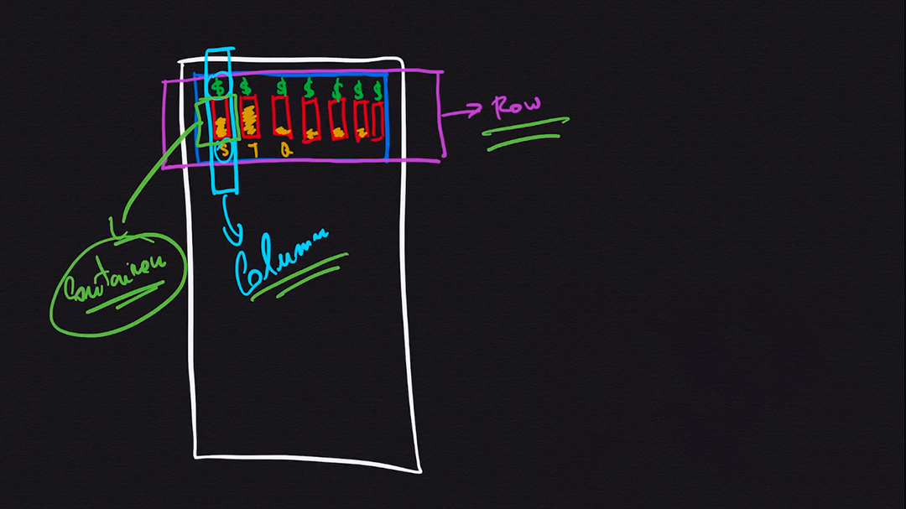

# SUMÁRIO<a name='sumario'></a>
* [PROJETO DESPESAS PESSOAIS](#projeto-despesas-pessoais)
* [CRIANDO VERSÃO INICIAL DO APP - AULA 89](#aula-89)
  * [Criação do Projeto no Flutter](#criacao-do-projeto-flutter)
* [COMBINANDO WIDGETS - AULA 90](#combinando-widgets)
  * [Código da Aula](#codigo-aula-90)
* [CRIANDO CLASSE DE  MODELO - AULA 93](#criando-classe-modelo)
* [MAPEAR DADOS PARA WIDGETS - AULA 94](#mapear-dados-para-widgets)
* [PERSONALIZANDO ITEM DA LISTA - AULA 95](#personalizando-item-da-lista)
  * [Item Card - Aula 95](#item-card)
  * [Código Atualizado - Aula 96](#codigo-atualizado-item-card)
  * [Aplicando Estilo ao Container - Aula 97](#aplicando-estilo-ao-container)
  * [Código Atualizado - Aula 97](#codigo-atualizado-aula-97)
  * [Aplicando Estilo ao Texto - Aula 98](#aplicando-estilo-ao-texto)
  * [Desafio: Estilo no Título e na Data - Aula 98](#desafio-estilo-no-titulo-e-na-data)
  * [Diferenças entre Container e Column/Row - Aula 99](#container-vs-column)
  * [Interpolação de Strings - Aula 100](#interpolacao-de-strings)
  * [ Instalando o Pacote Externo INTL - Aula 102](#instalando-pacote-externo-intl)
* [CRIANDO A TELA DE FORMULÁRIO - Aula 103](#criando-a-tela-de-formulario)
  * [Trabalhando com Variáveis no TextField - Aula 104](#trabalhando-com-variaveis-no-textfield)
* [REFATORAÇÃO - DIVIDINDO O APP EM WIDGETS - Aula 105](#refatoracao-dividindo-o-app-em-widgets)
  * [Código TransactionList() - Aula 105](#codigo-transaction_list)
  * [Código TransactionForm() - Aula 105](#codigo-transaction_form)
  * [Código TransactionUser() - Aula 105](#codigo-transaction_user)
  * [Código Main Refatorado - Aula 105](#codigo-main-refatorado)
* [INTEGRANDO COMPONENTES DO FOMULÁRIO COM A LISTA - Aula 106](#integrando-componentes-do-formulario-com-a-lista)
  * [***Comunicação Indireta*** onSubmit _addTransaction onPressed - Aula 107](#comunicacao-indireta-onpressed-onsubmit-addtransaction)
    * [Código onSubmit - Aula 107](#codigo-onsubmit)
    * [Código _addTransaction - Aula 107](#codigo-addtransaction)
    * [Código onPressed - Aula 107](#codigo-onpressed)
  * [Habilitando Rolagem da Tela - SCROLLVIEW - Aula 108](#habilitando-rolagem-da-tela)
    * [Código Componente Principal - Aula 108](#codigo-componente-principais)
    * [Código Outros Componentes - Aula 108](#codigo-outros-componente)
  * [Usando o Componente ListView - Aula 109](#usando-o-componente-listview)
    * [Código ListView.builder - Aula 109](#codigo-listviewbuilder)
  * [Configurando Teclado Numérico - Aula 110](#configurando-teclado-numerico)
    * [Função de validação do onSubmit - Aula 110](#funcao-de-validacao-do-onsubmit)
      * [Código _submitForm() - Aula 110](#codigo-submitform)
  * [Adicionando Botão de Ícone na APP Bar - Aula 111](#adicionando-botao-de-icone-appbar)
    * [Código Botãoo Ícone App Bar - Aula 111](#codigo-botao-icone-appbar)
  * [Adicionando um Botão Flutuante - Aula 111](#adicionando-botao-flutuante)
    * [Código Botão Flutuante - Aula 111](#adicionando-botao-flutuante)
* [Refatorando e Criando o Modal - Aula 112](#refatorando-e-criando-o-modal)
  * [Usando uma Função dentro do State - Aula 114](#usando-uma-funcao-dentro-do-state)
  * [Fechando o Formulário Modal - Aula 115](#fechando-formulario-modal)
* [Criando um Tema na Aplicação - Aula 116](#criando-um-tema-na-aplicacao)
  * [Instalando e Definindo Fontes na Aplicação - Aula 119](#instalando-e-definindo-fontes-na-aplicacao) 
    * [Código Pubspec.yaml - Aula 119](#codigo-pubspec)
  * [Definir as Fontes Padrão do appBar no Tema - Aula 119](#definir-as-fontes-padrao-do-appbar-no-tema)
    * [Código Tema appBar - Aula 119](#codigo-theme-titulo-appbar)
  * [Definir as Fontes e Estilos do Título no Tema - Aula 119](#definir-fontes-estilos-titulo-theme)
    * [Código Tema Títulos - Aula 119](#codigo-theme-titulos)
    * [Código Chamada do Título - Aula 119](#codigo-chamada-titulo)
  * [Adicionando e Registrando Imagens no APP - Aula 120](#adicionando-registrando-imagens-app)
    * [Código Alterado - Aula 120](#codigo-alterado-120)
  * [Planejando o Widget Chart - Aula 121](#planejando-widget-chart)
  * [Criando o Componente Chart - Aula 122](#criando-componente-chart)
    * [Configurando o Componente Card - Aula 122](#configurando-componente-chart)
    * [Função Getter - Aula 122](#funcao-getter)
    * [Atribuindo Valores Dinamicamente ao Chart - Aula 122](#atribuindo-valores-dinamicamente-chart)
    * [Criando a Soma dos Valores das Transações - Aula 122](#criando-soma-valores-transacoes)
    * [Mocando Transações para teste -Aula 123](#mocando-transacoes-teste)
    * [Criando um Filtro para as Transações Recentes - Aula 123](#criando-filtro-transacoes-recentes)
    * [Critério para o Filtro de Transações da Semana: - Aula 123](#criterios-filtro-transacao-semana)
    * [Mostrando o Resultado das Transações - Aula 124](#mostrando-resultado-transacoes)
    * [Criação do Componente Chart Bar - Aula 125](#criacao-componente-chart-bar)
    * [Criando a Barra de Percentagem - Aula 126](#criando-barra-percentage)
    * [Criando o Cálculo do Percentual - Aula 127](#criacao-calculo-percentual)
    * [Finalizando o Componente ChartBar - Aula 128](#finalizando-componente-chartbar)
* [Aula Bônus Flexible e Expanded - Aula 129](#aula-bonus-flexible-expanded)
  * [Refatorando o ListView em ListTile - Aula 130](#refatorando-listview-listtile)
  * [Refatorando o Formulário de Transações - Aula 133](#refatorando-formulario-transacoes)
  * [Exibindo o DatePicker() Modal de Data - Aula 134](#exibindo-datepicker-modal-data)
  * [Cadastrando uma Nova Transação com Data - Aula 135](#cadastrando-nova-transacao-data)
* [](#)
* [](#)
* [](#)
* [](#)
* [](#)

# MÓDULO 4

## PROJETO DESPESAS PESSOAIS <a name="projeto-despesas-pessoais"></a>

***Visão da Aplicação:*** O aplicativo servirá para cadastrar despesas pessoais diversas. 

***Exemplo:*** contas diversas, compras, lazer, etc. 

***O aplicativo terá o seguinte comportamento:***

* Terá um ***Card*** com os últimos 7 dias mostrando as despesas de cada dia e uma barra de percentagem do valor do dia em relação com os últimos 7 dias;

* Terá dois pontos de adição de despesas;

    * Um na ***AppBar*** e outro na base da tela centralizado;

* Clicando em um dos pontos de adição, abrirá um ***Modal*** para inserir as seguintes informações:

    * Título da Despesa;

    * Valor da Despesa;

    * Data da Despesa *(através de um botão que abrirá um calendário para selecionar a data)*;

* Abaixo do Card da Semana, fica a Lista de Despesas.

### CRIANDO VERSÃO INICIAL DO APP - AULA 89 <a name="aula-89"></a>

## Criação do Projeto no Flutter <a name="criacao-do-projeto-flutter">
#### [^Sumário^](#sumario)
No terminal digitar o comando a seguir para criar o projeto: flutter create expenses

> ***Dica:*** outra opção é adicionar a organização: ***flutter create --org br.com.nomeDaEmpresa expenses***
>
>Dessa forma o pacote do ***APP*** é criado corretamente: ***br.com.nomeDaEmpresa.expenses***

Dentro de ***lib***, abrir o arquivo ***main.dart*** limpar seu conteúdo e adicionar os códigos a seguir:

Para se criar uma ***Classe StatelessWidget*** usa se o atalho ***stl***, que será preenchido o esqueleto da ***Classe***. O cursor estará piscando e é só digitar o nome da Classe que no caso é ***ExpensesApp*** (que significa despesas) que será nosso ***Widget Principal***.

Com o cursor encima de ***StatelessWidget***, digite ***CTRL + PONTO*** e clique em `import MaterialApp`.

Substitua o `Container()` por `MaterialApp()`;

E dentro de `MaterialApp()` adicione a propriedade `home:`

```
main.dart
...
// ignore: use_key_in_widget_constructors
class ExpensesApp extends StatelessWidget {
  @override
  Widget build(BuildContext context) {
    return const MaterialApp(
      home: MyHomePage(),
    );
  }
}
...
```
Dentro de ***lib***, abrir o arquivo ***main.dart*** limpar seu conteúdo e adicionar os códigos a seguir:

Para se criar uma ***Classe StatelessWidget*** usa se o atalho ***stl***, que será preenchido o esqueleto da Classe. O cursor estará piscando e é só digitar o nome da Classe que no caso é ***ExpensesApp*** (que significa despesas) que será nosso ***Widget Principal***.

Com o cursor encima de ***StatelessWidget***, digite ***CTRL+PONTO*** e clique em `import MaterialApp`.

Substitua o `Container()` por `MaterialApp()`;

E dentro de ***MaterialApp()*** adicione a propriedade `home:`

```
main.dart
...
// ignore: use_key_in_widget_constructors
class ExpensesApp extends StatelessWidget {
  @override
  Widget build(BuildContext context) {
    return const MaterialApp(
      home: MyHomePage(),
    );
  }
}
...
```

Para o `home:` será criado um outro ***Componente StatelessWidget***:

```
main.dart
...
class MyHomePage extends StatelessWidget {
  @override
  Widget build(BuildContext context) {
    return Scaffold(
      appBar: AppBar(
        title: const Text('Despesas Pessoais'),
      ),
      body: const Text('Versão Inicial'),
    );
  }
}
```
O ***MyHomePage*** será passado como ***Componente do home***: Ex.: `home: MyHomePage(),`.

E para a aplicação começar a rodar, é preciso criar a ***Função main()*** através de uma ***Arrow Function***: `main() => runApp(ExpensesApp());`

E para Debugar a Aplicação pode se usar o atalho ***CTRL+F5***.

> Durante todo esse Módulo, toda a codificação será feita em um grande arquivo ***main*** e consequentemente uma ***Grande Árvore de Componentes***, mas ao final, o código será ***refatorado***.

## COMBINANDO WIDGETS <a name="combinando-widgets"></a>
#### [^Sumário^](#sumario)

No `body:` será substituído o ***Componente Center()*** pelo ***Componente Column()***, o *Column()* diferente do *Center()* recebe um ***Conjunto de Elementos*** `children: <Widget>` que é uma ***Lista***.

Dentro desta Lista serão colocados dois ***Card()***, será definido um `child: Text('Gráfico')`,  que será um ***Gráfico*** representando os gastos da semana e que será substituído mais a frente por um Componente.

Usando a propriedade `elevation: 5`, colocará uma sombra por trás do ***Componente Card()*** dando ao mesmo um ***efeito de volume***.

Usando a propriedade `color: Colors.blue,` adicionará a cor azul ao *background* do *Card()*.

Usando a propriedade `width: double.infinity,` fará com que o ***Card()*** ocupe toda a largura da tela.

> Para fazer com que o ***Card()*** ocupe toda a largura da tela, deverá envolver o ***Card()*** com um Container Wrap with Container.
> 
> Na Coluna `Column()` com a propriedade ***crossAxisAlignment*** é possível alinhar o ***Componente Column()*** que por padrão é alinhado ao centro `Column(crossAxisAlignment: CrossAxisAlignment.center);`

O outro Elemento também será um ***Card()*** e também será definido um `child: Text('Lista de Transações'),` e que será substituído mais a frente por um Componente.

> `mainAxisAlignment: MainAxisAlignment.spaceAround,`: Distribui os Elementos com espaços antes e depois dos mesmos na Vertical.
> crossAxisAlignment: CrossAxisAlignment.stretch,: Estica o Container na largura da tela, não sendo necessário o uso da propriedade `width: double.infinity,` no `Container()`

#### Código da Aula: <a name="codigo-aula-90"></a>
#### [^Sumário^](#sumario)

```
main.dart
...
      body: Column(
        mainAxisAlignment: MainAxisAlignment.spaceAround,
        crossAxisAlignment: CrossAxisAlignment.stretch,
       children: [
         // ignore: sized_box_for_whitespace
         Container(
          //width: double.infinity,
          child: const Card(
            child: Text('Gráfico'),
            color: Colors.blue,
            elevation: 5,
          ),
         ),
         const Card(
          child: Text('Lista de Transações'),
         ),
       ],
      ));
...
```

## CRIANDO CLASSE DE  MODELO <a name="criando-classe-modelo"></a>
#### [^Sumário^](#sumario)
Será criado uma ***Classe*** que irá representar os dados de uma transação, a ***Classe Transaction***.

Dento de ***lib***, será criado uma ***pasta*** chamada ***models*** e dentro será criado o arquivo ***transaction.dart*** que será nossa ***Classe***.

Dentro do arquivo será criado a ***Classe Transaction*** `class Transaction`  onde serão adicionados os ***Atributos da Classe*** e o ***Construtor da Classe*** com todos os valores ***requeridos*** *"obrigatórios"*.

```
transaction.dart
 
class Transaction {
  final String id;
  final String title;
  final double value;
  final DateTime date;
 
  // Construtor da Classe
  Transaction({
    required this.id,
    required this.title,
    required this.value,
    required this.date,
  });
}
```

Em ***MyHomePage*** dentro de ***main.dart***, será criado uma variável *privada* do Tipo *final* contendo a *Lista de transações* `final _transactions = [];`  não esquecendo de importar a Classe Transaction `import: './models/transaction.dart';`


```
main.dart
 
...
class MyHomePage extends StatelessWidget {
  MyHomePage();
  final _transactions = [
    Transaction(
      id: 'T1',
      title: 'Novo Tênis de Corrida',
      value: 310.76,
      date: DateTime.now(),
    ),
    Transaction(
      id: 'T2',
      title: 'Conta de Luz',
      value: 211.30,
      date: DateTime.now(),
    ),
  ];
...
```

## MAPEAR DADOS PARA WIDGETS <a name="mapear-dados-para-widgets"></a>
#### [^Sumário^](#sumario)
### Objetivo:

Exibir as transações criadas anteriormente em ***Listas*** visíveis na ***Interface Gráfica***, isso será feito através de um ***Map*** `.map()` em cima da ***Lista*** e depois convertendo em ***Elementos Visuais*** com o `.toList()`.

O *Elemento Card* que representa a *Lista de Transações*, será substituído pelo *Elemento Column* que conterá os ***Filhos*** `children:` da *Lista* e dentro dos ***children*** será feito o mapeamento.

Em ***children***, a ***Lista*** será substituída pela ***Função Map*** `_transactions.map()`,  que receberá outra Função e essa Função, irá receber cada um dos ***Elementos*** que no caso é a transação `(tr)`  convertendo um ***Objeto do Tipo Transaction*** em um ***Componente Visual*** e no final do ***Map*** usar o `.toList()` para converter em uma *Lista*.

E no final, ter uma ***Lista*** dentro de `children:` associado a Coluna.
```
main.dart

Column(
  children: _transactions.map((tr){
    return Card(
      child: Text(tr.title),
    );
  }).toList(),
),
```
Neste exemplo será apresentado uma ***Lista*** contendo somente o ***Título*** de cada ***transação***.

## PERSONALIZANDO ITEM DA LISTA <a name="personalizando-item-da-lista"></a>
#### [^Sumário^](#sumario)
### ITEM CARD <a name="item-card"></a>

Cada ***Item da Lista*** será um ***Card*** e dentro desde *Card* estarão os ***Elementos da Transação*** e a distribuição se dará da seguinte maneira:

* O ***Elemento Card()*** conterá todos os elementos;
* O ***Elemento Row()*** conterá o Valor, o Título e a Data;
* O ***Elemento Container()*** conterá o Valor;
* O ***Elemento Column()*** conterá o Título e a Data.

### CÓDIGO ATUALIZADO <a name="codigo-atualizado-item-card"></a>
#### [^Sumário^](#sumario)
```
Column(
  children: _transactions.map((tr) {
    return Card(
      child: Row(
        children: [
          Container(
            child: Text(tr.value.toStringAsFixed(2)),
          ),
          Column(
            children: [
              Text(tr.title),
              Text(tr.date.toString()),
            ],
          )
        ],
      ),
    );
  }).toList(),
),
```

## APLICANDO ESTILO AO CONTAINER <a name="aplicando-estilo-ao-container"></a>
#### [^Sumário^](#sumario)
Para aplicar estilo aos componentes do Flutter, usa-se as propriedades e atributos dos Widgets.

Agora iremos aplicar alguns estilos ao ***Container*** que contém o ***valor***:

Para criar a ***Margem Externa:*** `margin: EdgeInserts.symmetric(horizontal: 15, vertical: 10),` com isso o Container terá uma margem.

Para criar uma ***borda ao redor do Container*** vamos usar o *Atributo* `decoration:` com a *Classe* `BoxDecoration()` e dentro usar as Propriedades `border:  Border.all()` dentro será configurado a cor `color: Colors.black,` e a largura da borda `width: 2,`

Para criar uma ***Margem Interna*** usa-se o `padding: EdgeInsets.all(10),` com isso se coloca um espaço de 10 em todos os lados.

### Código Atualizado <a name="codigo-atualizado-aula-97"></a>
#### [^Sumário^](#sumario)

```
Container(
  margin: const EdgeInsets.symmetric(
    horizontal: 15,
    vertical: 10,
  ),
  decoration: BoxDecoration(
      border: Border.all(
    color: Colors.black,
    width: 2,
  )),
  padding: const EdgeInsets.all(10),
  child: Text(tr.value.toStringAsFixed(2)),
),
```

## Aplicando Estilo ao Texto <a name="aplicando-estilo-ao-texto"></a>
#### [^Sumário^](#sumario)
Para dar estilo ao texto usa-se o `style:`  juntamente com o `TextStyle(),`  e dentro dos parênteses usa-se os parâmetros a seguir para configurar o ***Estilo do Texto***:

* No ***Peso da Fonte*** `fontWeight:` pode escolher entre diversos tipos tais como: bold (negrito), normal, etc. `fontWeight: FontWeight.bold,`.
* No ***Tamanho da Fonte*** `fontSize: 20,`
* Na ***Cor da Fonte*** `color: Colors.purple,`
```
style: const TextStyle(
    fontWeight: FontWeight.bold,
    fontSize: 20,
    color: Colors.purple,
),
```

## Desafio: Estilo no Título e na Data <a name="desafio-estilo-no-titulo-e-na-data"></a>
#### [^Sumário^](#sumario)
O desafio é colocar o Título e a Data alinhada à esquerda.

Colocar o Título em negrito e com a fonte 16 e a Data colocar em cinza.

### Resposta:
1. Para alinhar à esquerda usa-se `crossAxisAlignment: CrossAxisAlignment.start,` no Elemento `Column()`.
2. Para colocar o ***Título em negrito***, antes precisa usar a *Propriedade* `style:` a *Classe* `TextStyle()` e dentro do TextStyle que se usa-se o ***Peso da Fonte*** para deixar em negrito. `fontWeight: FontWeight.bold,`.
3. Já para mudar o tamanho da fonte, usa-se `fontSize: 16,` dentro do `TextStyle()` é claro. :-P.
4. Para mudar a cor da Data para cinza, usar-se `color: Colors.black45,` dentro do `style: const TextStyle()`.

```
Column(
  crossAxisAlignment: CrossAxisAlignment.start,
  children: [
    Text(tr.title,
        style: const TextStyle(
          fontWeight: FontWeight.bold,
          fontSize: 16,
          color: Colors.black,
        )),
    Text(
      tr.date.toString(),
      style: const TextStyle(
        color: Colors.black45,
      ),
    ),
  ],
)
```

## DIFERENÇAS ENTRE CONTAINER E COLUMN/ROW <a name="container-vs-column"></a>
#### [^Sumário^](#sumario)


## Interpolação de Strings <a name="interpolacao-de-strings">
#### [^Sumário^](#sumario)

Usando a Interpolação de Strings, será associado ao Valor o símbolo da moeda R$.

Isso pode ser feito de duas maneiras:

1. Usando a ***Concatenação de Strings*** `child: Text('R\$ ' + tr.value.toStringAsFixed(2)),` sendo que, para o ***$*** aparecer corretamente é preciso usar uma barra invertida \ antes do símbolo do dollar, pois é um caractere especial dentro da ***String***.

2. Usando a ***Interpolação de String*** `child: Text('R\$ ${tr.value.toStringAsFixed(2)}'),` usando caractere especial ***$*** seguido de um ***par de chaves*** com a variável dentro.

    >***Dica:*** Se o valor da variável não tivesse ponto "**.**" como no exemplo, não seria preciso usar as chaves.

## Instalando o Pacote Externo INTL <a name='instalando-pacote-externo-intl'></a>
#### [^Sumário^](#sumario)
Para ajustar o ***valor da Data*** que está sendo exibido de forma equivocada, é preciso instalar um pacote via ***pubspec.yaml.***

Para saber que pacote usar para configurar a Data, é só pesquisar na internet, mas, o pacote que estará sendo instalado é o ***INTL*** que significa ***Internacionalização***.

O procedimento para instalar o pacote é relativamente fácil, sendo preciso ficar atendo somente à ***tabulação*** para não instalar o pacote no lugar errado, o mesmo deve ser instalado em `dependencies:` e deve ser tabulado uma vez, para ser relativo às ***dependências*** e não a outro pacote.

```
pubspec.yaml
...
dependencies:
  flutter:
    sdk: flutter
 
  intl: ^0.17.0
...
```

Agora para usar o ***INTL***, será preciso importa-lo para dentro do arquivo ***main.dart***. ***Ex.:*** `import 'package:intl/intl.dart';`.

Depois para poder formatar corretamente a ***Data***, devemos substituir o `tr.date.toString(),`  por `DateFormat('dd-MM-y').format(tr.date),`  para que possamos configurar a ***máscara da Data***, existem outros tipos de configuração olhe na documentação para mais informações.

```
main.dart
...
  Text(
     DateFormat('dd-MM-y').format(tr.date),
...
```

## Criando a Tela de Formulário <a name='criando-a-tela-de-formulario'></a>
#### [^Sumário^](#sumario)
A princípio a ***Tela de Formulário*** será criada em um ***Card***, mas posteriormente será transformada em um ***Modal***.

```
main.dart
...
Card(
    elevation: 5,
    child: Padding(
    padding: const EdgeInsets.all(10),
    child: Column(
        children: [
        const TextField(
            decoration: InputDecoration(
            labelText: 'Título',
            ),
        ),
        const TextField(
            decoration: InputDecoration(
            labelText: 'Valor (R\$)',
            ),
        ),
        Row(
            mainAxisAlignment: MainAxisAlignment.end,
            children: [
            Padding(
                padding: const EdgeInsets.fromLTRB(0, 5, 0, 0),
                child: TextButton(
                style: ButtonStyle(
                    foregroundColor: MaterialStateProperty.all<Color>(
                        Colors.purple),
                ),
                onPressed: () {},
                child: const Text('Nova Transação'),
                ),
            ),
            ],
        )
        ],
    ),
    ),
)
...
```

## Trabalhando com Variáveis no TextField <a name='trabalhando-com-variaveis-no-textfield'></a>
#### [^Sumário^](#sumario)
A principio será usado variáveis em um Componente StatelessWidget o que não é recomendado (alteração de Estado), mas, mais a frente será corrigido colocando em um ***Componente StatefulWidget***.

É preciso ter cuidado, pois, mesmo criando uma variável do Tipo ***final***, `final titleController = TextEditingController();`.

Por mais que se tenha marcado essa variável como sendo ***final***, ainda assim, será preciso alterar o ***Estado Interno*** desta variável e não é bom, mesmo tendo um atributo ***final***.

Ainda assim, que dentro desta ***Classe*** `TextEditingController()` os ***Estados Internos*** estejam se alterando, ainda assim, é indicado se colocar dentro de um ***Componente StatefulWidget***.

Desta forma, está *"aderente"* ao ***Componente StatelessWidget*** porque os dois atributos foram marcados como ***final*** mas isso não é suficiente, pois, o ***Estado Interno*** estará se modificando conforme é digitado algo no ***TextField***, por enquanto irá continuar funcionando, mas, mais a frente irá quebrar mas será corrigido.

```
main.dart
...
class MyHomePage extends StatelessWidget {
  final titleController = TextEditingController();
  final valueController = TextEditingController();
...
```
No ***TextField Título*** será adicionado o atributo `controller: titleController,` e no ***TextField Valor***, será adicionado o atributo `controller: valueController,`

```
main.dart
...
TextField(
    controller: titleController,
    decoration: const InputDecoration(
    labelText: 'Título',
    ),
),
TextField(
    controller: valueController,
    decoration: const InputDecoration(
    labelText: 'Valor (R\$)',
    ),
),
...
```

## Refatoração - Dividindo o APP em Widgets <a name='refatoracao-dividindo-o-app-em-widgets'></a>
#### [^Sumário^](#sumario)

O primeiro passo da ***Refatoração***, é criar a pasta ***Components*** dentro da pasta ***Lib***, depois disso será criado o arquivo ou componente ***transactions_list.dart*** que conterá parte do código do arquivo ***main.dart*** que será todo o conteúdo da ***lista de despesas***.

Dentro do arquivo ***transactions_list.dart*** será o ***Componente StatelessWidget*** `TransactionsList()`  e a seguir o código do arquivo.

<a name='codigo-transaction_list'></a>

#### [^Sumário^](#sumario)

```
transaction_list.dart
 
import 'package:flutter/material.dart';
import './models/transaction.dart';
import 'components/transaction_list.dart';
import 'components/transaction_form.dart';
 
class TransactionList extends StatelessWidget {
  final List<Transaction> transactions;
 
  // ignore: use_key_in_widget_constructors
  const TransactionList(this.transactions);
 
  @override
  Widget build(BuildContext context) {
    return Column(
      children: transactions.map((tr) {
        return Card(
          child: Row(
            children: [
              Container(
                margin: const EdgeInsets.symmetric(
                  horizontal: 15,
                  vertical: 10,
                ),
                decoration: BoxDecoration(
                    border: Border.all(
                  color: Colors.purple,
                  width: 2,
                )),
                padding: const EdgeInsets.all(10),
                child: Text(
                  'R\$ ${tr.value.toStringAsFixed(2)}',
                  style: const TextStyle(
                    fontWeight: FontWeight.bold,
                    fontSize: 20,
                    color: Colors.purple,
                  ),
                ),
              ),
              Column(
                crossAxisAlignment: CrossAxisAlignment.start,
                children: [
                  Text(tr.title,
                      style: const TextStyle(
                        fontWeight: FontWeight.bold,
                        fontSize: 16,
                        color: Colors.black,
                      )),
                  Text(
                    DateFormat('dd-MM-y').format(tr.date),
                    style: TextStyle(
                      color: Colors.grey[600],
                    ),
                  ),
                ],
              )
            ],
          ),
        );
      }).toList(),
    );
  }
}
```

Agora, para usar esse ***Componente*** que acabou de ser criado, dentro de ***main.dart*** deverá ser importado o arquivo ***transaction_list.dart***. `import 'components/transaction_list.dart'`;

Depois deverá chamar o ***Componente TransactionList()*** recebendo por parâmetro o ***_transaction*** `TransactionList(_transactions),`  no mesmo local de onde o código foi retirado no processo anterior de ***refatoração***.

Agora será criado o ***Componente TransactionForm()***.
Dentro da pasta ***Components***, será criado o arquivo ***transaction_form.dart*** e dentro do arquivo, será criado o ***Componente StatelessWidget*** `TransactionForm()` que conterá o conteúdo do ***Card*** que contém o ***formulário*** de Nova Transação que futuramente será transformado em um ***Modal***.

<a name='codigo-transaction_form'></a>

#### [^Sumário^](#sumario)

```
transaction_form.dart
 
import 'package:flutter/material.dart';
 
class TransactionForm extends StatelessWidget {
  final titleController = TextEditingController();
  final valueController = TextEditingController();
 
  @override
  Widget build(BuildContext context) {
    return Card(
      elevation: 5,
      child: Padding(
        padding: const EdgeInsets.all(10),
        child: Column(
          children: [
            TextField(
              controller: titleController,
              decoration: const InputDecoration(
                labelText: 'Título',
              ),
            ),
            TextField(
              controller: valueController,
              decoration: const InputDecoration(
                labelText: 'Valor (R\$)',
              ),
            ),
            Row(
              mainAxisAlignment: MainAxisAlignment.end,
              children: [
                Padding(
                  padding: const EdgeInsets.fromLTRB(0, 5, 0, 0),
                  child: TextButton(
                    style: ButtonStyle(
                      foregroundColor:
                          MaterialStateProperty.all<Color>(Colors.purple),
                    ),
                    onPressed: () {
                      print(titleController.text);
                      print('R\$ ${valueController.text}');
                    },
                    child: const Text('Nova Transação'),
                  ),
                ),
              ],
            )
          ],
        ),
      ),
    );
  }
}
```

Agora, para usar esse ***Componente*** que acabou de ser criado, dentro de ***main.dart*** deverá ser importado o arquivo ***transaction_form.dart***. `import 'components/transaction_form.dart';`

Depois deverá chamar o ***Componente StatelessWidget*** `TransactionForm(),` no mesmo local de onde o código foi retirado no processo anterior de ***refatoração***.

Seguindo o processo de ***refatoração***, será criado mais um ***Componente*** *"que mais para frente será excluído"* que é o ***Componente StatefulWidget*** `TransactionUser()` que irá controlar a ***Lista de Transações***, pois, mesmo a Lista sendo ***final***, o conteúdo da Lista pode ir evoluindo *(recebendo mais itens)*. A ***Lista é final***, porque será possível mudar a referencia para a ***variável _transaction*** mas a Lista pode ser mexida, ***cadastrando e excluindo novos elementos***.

Deverá ser importado o arquivo ***transaction_user.dart.*** `import 'components/transaction_user.dart';`, ***transaction_list.dart*** `import 'components/transaction_list.dart';`, ***transaction_form.dart*** `import 'components/transaction_form.dart';` e ***transaction.dart*** `import '../models/transaction.dart';`.

<a name='codigo-transaction_user'></a>

#### [^Sumário^](#sumario)

```
transaction_user.dart
 
import 'package:flutter/material.dart';
import 'transaction_list.dart';
import 'transaction_form.dart';
import '../models/transaction.dart';
 
class TransactionUser extends StatefulWidget {
  @override
  _TransactionUserState createState() => _TransactionUserState();
}
 
class _TransactionUserState extends State<TransactionUser> {
  final _transactions = [
    Transaction(
      id: 'T1',
      title: 'Novo Tênis de Corrida',
      value: 310.76,
      date: DateTime.now(),
    ),
    Transaction(
      id: 'T2',
      title: 'Conta de Luz',
      value: 211.30,
      date: DateTime.now(),
    ),
  ];
 
  @override
  Widget build(BuildContext context) {
    return Column(
      children: [
        TransactionList(_transactions),
        TransactionForm(),
      ],
    );
  }
}
```

Agora, para usar esse ***Componente*** que acabou de ser criado, dentro de ***main.dart*** deverá ser importado o arquivo ***transaction_user.dart***. `import 'components/transaction_user.dart';`.

Depois deverá chamar o ***Componente StatefulWidget*** `TransactionUser()` no mesmo local de onde o código foi retirado no processo anterior de **refatoração**.

Agora, após todo esse processo de refatoração, o arquivo ***main.dart*** ficou muito mais enxuto e com isso melhor legível e ***mais fácil de dar manutenção***.

<a name='codigo-main-refatorado'></a>

#### [^Sumário^](#sumario)

```
main.dart
 
import 'package:flutter/material.dart';
import 'components/transaction_user.dart';
 
main() {
  runApp(ExpensesApp());
}
 
// ignore: use_key_in_widget_constructors
class ExpensesApp extends StatelessWidget {
  @override
  Widget build(BuildContext context) {
    return const MaterialApp(
      home: MyHomePage(),
    );
  }
}
 
class MyHomePage extends StatelessWidget {
  // ignore: use_key_in_widget_constructors
  const MyHomePage();
 
  @override
  Widget build(BuildContext context) {
    return Scaffold(
        appBar: AppBar(
          title: const Text('Despesas Pessoais'),
        ),
        body: Column(
          crossAxisAlignment: CrossAxisAlignment.stretch,
          children: [
            // ignore: sized_box_for_whitespace, avoid_unnecessary_containers
            Container(
              // Usando "crossAxisAlignment: CrossAxisAlignment.stretch," na Column()
              // não é necessário o uso de "width: double.infinity,"
              //width: double.infinity,
              child: const Card(
                child: Text('Gráfico'),
                color: Colors.blue,
                elevation: 5,
              ),
            ),
            TransactionUser(),
          ],
        ));
  }
}
```

## Integrando Componentes do Formulário com a Lista <a name='integrando-componentes-do-formulario-com-a-lista'></a>
#### [^Sumário^](#sumario)
O objetivo é inserir uma ***Nova Transação*** a partir do ***Formulário*** e fazer com que apareça na ***Lista de Transações***.

E que fará o intermédio da relação entre o ***Formulário*** e a ***Lista***, é justamente o ***Componente StatefulWidget TransactionUser()***.

Neste Componente dá para perceber claramente, o conceito de ***Comunicação Direta*** e ***Comunicação Indireta***.

***Comunicação Direta***: é quando se tem um ***Componente Pai*** passando ***Dados*** para o ***Componente Filho*** para que ele possa ser renderizado.

***Exemplo***: o Componente StatelessWidget `TransactionList(_transactions)` depende da ***Lista de Transações*** `_transactions`, se for passado uma ***Lista Vazia*** `TransactionList([])`, automaticamente o ***TransactionList()*** não mostrará mais nenhuma Transação porque foi passado uma Lista Vazia.

O Dono das informações das Transações, é o ***Componente StatefulWidget TransactionUser()***, então, claramente quem tem as informações é o `TransactionUser()` e ele está passando via ***parâmetro/construtor*** para outro ***Componente StatelessWidget Filho*** para que possa ser renderizado e isso se caracteriza uma ***Comunicação Direta***.

Dentro do ***Método Build Pai*** *"Componente StatefulWidget TransactionUser()"* há uma referencia explícita ao ***Elemento Filho*** *"TransactionList(_transactions)"*  já que se tem uma ***Árvore e Componentes***, o ***Pai*** faz uma referencia para o ***Filho***.

Agora, quando se quer que o *Filho* se comunicando com o *Pai*, ou seja, a partir do ***TransactionForm()***, precisa-se saber quando uma **Nova Transação** é cadastrada, e também precisa ser recebido de ***TransactionForm()*** o ***Título*** e o ***Valor***, ou seja, esses ***Dados*** pertencem no momento a ***TransactionForm()***, e quando o usuário clicar em **Nova Transação**, automaticamente é para se ter uma chamada ao **Componente Pai** *"Componente StatefulWidget TransactionUser()"* que precisa ser notificado quando o Usuário cadastrar uma **Nova Transação**, para assim adicionar na Lista os ***Dados*** desta nova transação e o ***Componente Filho*** *"TransactionList()"* ser Atualizado.

Agora será definido uma nova ***Função*** que se chamará: ***_addTransaction()*** e que receberá dois parâmetros: (***String title, double value***) ou seja, o valor já irá vir transformado em double embora o valor passado no Formulário seja do Tipo String. ***Ex.:*** `_addTransaction(String title, double value){};`.

Dentro das chaves, será criado uma ***Nova Transação***: `final newTransaction` que irá receber um ***Objeto do Tipo Transaction()***. ***Ex.:*** `final newTransaction = Transaction();`

E dentro dos parênteses, serão adicionados os atributos e os parâmetros para a criação desta ***Nova Transação***, e os parâmetros são:

>Lembrando que primeiro vem o atributo da ***Função*** seguido de dois pontos ex.: `title:` e logo após, o parâmetro nomeado `title`.

* id: Random().nextDouble().toString, (cria uma String randômica com valor double)
* title: title,
* value: value,
* date: DateTime.now(),

```
transaction_user.dart

...
  // Adiciona uma Nova Transação
  _addTransaction(String title, double value) {
    final newTransaction = Transaction(
      id: Random()
          .nextDouble()
          .toString(), // cria um ID único randômico com valor double e transforma em String.
      title: title,
      value: value,
      date: DateTime.now(),
    );
 
      setState((){
          _transactions.add(newTransaction);
      });
  }
...
```

O próximo passo é, dentro de um ***setState(() {});*** será alterado o ***Estado da Lista*** `_transactions` ***adicionar*** `.add()` a ***Nova Transação*** criada acima `(newTransaction);`.

***Exemplo:***

```
   setState((){
     _transactions.add(newTransaction);
   });
```

Alterando o Estado, automaticamente por estar dentro de um ***Componente StatefulWidget***, quando o ***Estado muda***, a ***Árvore de Componentes*** também será atualizada.

Quando se tem um ***Componente StatelessWidget***, a única coisa que pode alterar a visualização, é passar um novo ***Dado/Parâmetro*** para o ***Construtor*** daquele ***Componente StatelessWidget***, ou seja, externamente o ***Dado mudou***, então, se passa o ***Novo Dado*** e o Componente se atualiza.

Que é o caso do ***Componente TransactionList TransactionList()***, quando essa ***Lista de Transações*** alterar, automaticamente o ***Método Build*** vai rodar e será passado uma ***Nova Lista de Transações*** `_transactions` para o `TransactionList()`, então, de forma externa o ***TransactionList()*** será atualizado porque algo externo foi alterado.

```
transaction_user.dart
 
...
  @override
  Widget build(BuildContext context) {
    return Column(
      children: [
        TransactionList(_transactions),
        TransactionForm(),
      ],
    );
  }
}
...
```

Quando se tem um ***Componente StatefulWidget***, pode se alterar de duas formas:

* ***Externamente:*** quando houve alteração de um parâmetro recebido via ***Construtor*** de um Componente Stateful.

* ***Estado Alterado:*** quando o ***Estado do Componente*** alterou e então o Componente é ***renderizado/atualizado***, e se pode visualizar a alteração na aplicação.

## Comunicação Indireta onPressed onSubmit _addTransaction <a name='comunicacao-indireta-onpressed-onsubmit-addtransaction'></a>
#### [^Sumário^](#sumario)

Agora será estabelecida a ***Comunicação Indireta***, porque, o *TransactionForm()* precisa conversar com o ***Pai*** que é o ***TransactionUser()*** e para isso, é esperado receber como parâmetro uma ***Função*** `Function() final` que vai retornar `void` e receberá dois parâmetros `String, double` que receberá o nome de `onSubmit`, já que está dentro de um ***Formulário*** e o mesmo será submetido, ou seja, na hora de submeter será chamado essa ***Função*** passando cada um dos campos do ***Formulário***.

***Exemplo:*** `final void Function(String, double) onSubmit;`

Então, espera-se receber como parâmetro essa ***Função onSubmit*** no ***Construtor*** do **TransactionForm**.

***Exemplo:*** `TransactionForm(this.onSubmit);`

<a name='codigo-onsubmit'></a>

#### [^Sumário^](#sumario)
```
transaction_form.dart
 
...
    final void Function(String, double) onSubmit;
 
    TransactionForm(this.onSubmit);
...
```

E dentro do `TransactionUser()` existe a ***Função*** `_addTransaction()` que é exatamente a mesma ***Função*** que será recebida lá dentro de `TransactionForm()`.

Dentro do ***Método Build***, na construção do `TransactionForm()`, o ***Método Adicionar Transação*** `_addTransaction`, é possível passar essa ***Função*** como parâmetro.

***Exemplo:*** `TransactionForm(_addTransaction);`.

<a name='codigo-addtransaction'></a>

#### [^Sumário^](#sumario)
```
transaction_user.dart

...
  @override
  Widget build(BuildContext context) {
    return Column(
      children: [
        // Comunicação Direta -> através de Dados
        TransactionList(_transactions),
        // Comunicação Indireta -> através de uma Função que espera os Dados vindos do Componete Filho
        TransactionForm(_addTransaction),
      ],
    );
  }
}
...
```
E lá dentro do ***Método TransactionForm()*** será preciso definir, o momento exato que esse Método precisa ser chamado.

A principio, isso acontecerá quando o ***Botão*** `TextButton()` for ***clicado*** `onPressed: () {},`

Primeiro será preciso armazenar em uma variável do ***Tipo final*** o texto do ***Título*** `final title = titleController.text;` e em uma variável do ***Tipo final*** o texto do ***Valor***  `final value = double.tryParse(valueController.text) ?? 0.0;` que significa que tentará converter o texto em um ***valor double*** `double.tryParse(valueController.text)` e caso não consiga `??`, colocará o ***valor padrão*** `0.0`.

O próximo passo é chamar o ***onSubmit*** que foi recebido por parâmetro, passando o ***Título*** `title` e o ***Valor*** `value`. ***Ex.:*** `onSubmit(title, value);`

Então o que aconteceu foi que, o ***Componente Pai*** passou uma ***Função*** a `onSubmit()` para o ***Componente Filho*** através do ***Construtor***.

No ***transaction_user.dart***, no ***Construtor*** do `TransactionForm()` foi passado a ***Função*** `_addTransaction` que ele espera receber como parâmetro, e dentro do ***transaction_form.dart*** dentro do ***Componente TransactionForm*** através de seu ***Construtor***, recebe a ***Função onSubmit***. ***Exemplo:*** `TransactionForm(this.onSubmit);`

E dentro ***Componente*** se sabe qual o momento exato que o usuário quer ***submeter*** o ***Formulário***, que será dentro do `TextButton()` no `onPressed:` onde os ***Dados*** do ***Título*** e ***Valor***, foram adicionados em ***variáveis*** e depois são passados por parâmetro para o `onSubmit()`.

<a name='codigo-onpressed'></a>

#### [^Sumário^](#sumario)
```
transaction_form.dart
 
...
onPressed: () {
    final title = titleController.text;
    final value = double.tryParse(valueController.text) ?? 0.0;
    onSubmit(title, value);
},
...
```

A dinâmica na comunicação entre os ***Componentes***, a ***Aplicação em Flutter***, Angular, Vue, React, etc. é uma ***Grande Árvore de Componentes***, então, uma das grandes questões quanto a isso, é como esses ***Componentes*** vão se comunicar e como os ***Dados*** serão passados de um ***Componente*** para outro.

Como se consegue receber ***Dados*** de um ***Componente Filho?*** é exatamente aqui que entra as duas comunicações mais básicas entre ***Componentes***:

***Comunicação Direta ->*** que é o ***Componente Pai*** passando ***Dados*** para o ***Componente Filho***.

***Comunicação Indireta ->*** que é o ***Componente Pai*** passando uma ***Função*** para o ***Componente Filho***, que no momento certo o ***Filho*** chama essa ***Função*** passando ***Dados*** para o ***Componente Pai***.

## Habilitando Rolagem da Tela - SCROLLVIEW <a name='habilitando-rolagem-da-tela'></a>

#### [^Sumário^](#sumario)

Para habilitar a rolagem da Tela, usa-se o ***Componente SingleChildScrollView*** e para que o mesmo funcione corretamente, o ***Componente Pai*** precisa ter um tamanho definido.

E para poder habilitar esse componente, deve-se envolver o ***Componente Pai*** usando o ***CTRL+PONTO*** e selecionando a opção ***Wrap with widget*** e depois digitando `SingleChildScrollView` no lugar da opção padrão `Widget`.

Usando o ***SingleChildScrollView()*** no `body:` do APP torna todo o ***Corpo do APP rolável***.

<a name='codigo-componente-principal'></a>

#### [^Sumário^](#sumario)

```
main.dart
 
...
body: SingleChildScrollView(
    child: Column(
    crossAxisAlignment: CrossAxisAlignment.stretch,
    children: [
        // ignore: sized_box_for_whitespace, avoid_unnecessary_containers
        Container(
        // Usando "crossAxisAlignment: CrossAxisAlignment.stretch," na Column()
        // não é necessário o uso de "width: double.infinity,"
        //width: double.infinity,
        child: const Card(
            child: Text('Gráfico'),
            color: Colors.blue,
            elevation: 5,
        ),
        ),
        TransactionUser(),
    ],
    ),
));
...
```

Também é possível usar em outros componentes da Aplicação, mas é preciso envolve-lo com um `Container` e atribuir uma ***altura*** `height:` para o `Container`, para que o `SingleChildScrollView` funcione corretamente.

Mas para isso, o ***Componente Pai*** `body:` no caso, também precisa estar com a ***Rolagem da Tela habilitada***.

<a name='codigo-outros-componente'></a>

#### [^Sumário^](#sumario)

```
transaction_list.dart
 
...
  @override
  Widget build(BuildContext context) {
    return Container(
      height: 400,
      child: SingleChildScrollView(
        child: Column(
          children: transactions.map((tr) {
            return Card(
              child: Row(
                children: [
                  Container(
                    margin: const EdgeInsets.symmetric(
                      horizontal: 15,
                      vertical: 10,
                    ),
...
```

## Usando o Componente ListView <a name='usando-o-componente-listview'></a>

#### [^ Sumário ^](#sumario)

O ***ListView*** é um ***Componente*** específico para se criar uma Lista de Elementos, pois, neste ***Componente*** ele já engloba o SingleChildScrollView juntamente com o Column.

O diferencial e a vantagem de se usar o ***Componente ListView*** além dele ser específico para ***Lista***, é a facilidade de se configurar Listas muitos grande.

Pois, o ***ListView*** possibilita que somente parte da ***Lista*** seja renderizada, economizando assim o uso de memória do ***APP***.

E assim como no `SingleChildScrollView` o `ListView` também precisa ser ***envolvido*** por um ***Container*** `Wrap with container` e ter sua ***altura*** `height:` definida para que funcione corretamente.

A forma correta de se trabalhar com ***ListView***, é usar a ***notação ponto*** `.builder` e a partir do ***builder*** ele não irá mais esperar um `children:` mas sim dois atributos muito importantes:

* `itemCount: transactions.length,` quantidade de itens *(tamanho da quantidade de transações)*.

* `itemBuilder: (ctx, index) {...};` que recebe uma ***Função*** e o primeiro parâmetro é um ***contexto*** `ctx` que não é o ***context*** do ***BuildContext*** e o segundo é o ***índice*** `index` que é o elemento a ser renderizado na chamada da ***Função***.

* Dentro das chaves `{...}`, será colocado todo o conteúdo do `return` do `Método Widget build(BuildContext context)` e como a variável `tr` não estará mais disponível a mesma deverá ser criada  dentro desta ***Função*** `final tr = transactions[index],`  pega o índice da Lista.

* Essa ***Função*** será chamada a partir do momento que for precisando da ***informação***, ou seja, os ***elementos visíveis na Tela*** através da configuração da ***altura*** `height:` do `Container`. Todos os Elementos fora da Tela, ou seja, não visíveis não serão renderizados, economizando assim a memória do dispositivo.

<a name='codigo-listviewbuilder'></a>

#### [^ Sumário ^](#sumario)

```
transaction_list.dar
 
...
  @override
  Widget build(BuildContext context) {
    return Container(
      height: 400,
      child: ListView.builder(
        itemCount: transactions.length,
        itemBuilder: (ctx, index) {
          final tr = transactions[index];
 
          return Card(
            child: Row(
              children: [
                Container(
                  margin: const EdgeInsets.symmetric(
                    horizontal: 15,
                    vertical: 10,
                  ),
                  decoration: BoxDecoration(
                      border: Border.all(
                    color: Colors.purple,
                    width: 2,
                  )),
                  padding: const EdgeInsets.all(10),
                  child: Text(
                    'R\$ ${tr.value.toStringAsFixed(2)}',
                    style: const TextStyle(
                      fontWeight: FontWeight.bold,
                      fontSize: 20,
                      color: Colors.purple,
                    ),
                  ),
                ),
                Column(
                  crossAxisAlignment: CrossAxisAlignment.start,
                  children: [
                    Text(tr.title,
                        style: const TextStyle(
                          fontWeight: FontWeight.bold,
                          fontSize: 16,
                          color: Colors.black,
                        )),
                    Text(
                      DateFormat('dd-MM-y').format(tr.date),
                      style: TextStyle(
                        color: Colors.grey[600],
                      ),
                    ),
                  ],
                )
              ],
            ),
          );
        },
      ),
    );
  }
  ```

  ## Configurando Teclado Numérico <a name='configurando-teclado-numerico'></a>
  #### [^Sumário^](#sumario)

Para se configurar um teclado numérico é muito simples e existem duas opções:

* ***No Android:*** dentro de um ***Componente TextField()*** usa-se o ***atributo*** `keyboard:` com o ***Componente*** `TextInputType.number` habilitando todas as funções do teclado numérico inclusive o ***separador decimal***.

* ***Exemplo:*** `TextField(keyboard: TextInputType.number)`.

* ***No IOS:*** dentro de um ***Componente*** `TextField()` usa-se o ***atributo*** `keyboard:` com o ***Componente*** `TextInputType.numberWithOptions(decimal: true)`, precisa usar `numberWithOptions` e só aí setar para aceitar o ***separador decimal*** `(decimal: true)`

* ***Exemplo:*** `TextField(keyboard: TextInputType.numberWithOptions(decimal: true)`.

> ***Dica:*** A última opção funciona tanto no ***IOS*** quanto no ***Android***, mas se for criar um ***APP*** sem suporte a ***IOS***, use a primeira opção.

## Função de validação do onSubmit <a name='funcao-de-validacao-do-onsubmit'></a>

#### [^Sumário^](#sumario)

Criar a ***Função*** `_submitForm()`, refatorando a ***Função*** que está no `onPressed:` e a colocando dentro da nova ***Função***.

E para evitar que o `onSubmit()` seja chamado se houver algum ***Dado Inválido*** no ***Título*** ou no ***Valor***, será usando a seguinte regra: ***Se*** `if` o campo do ***Título estiver Vazio*** `title.isEmpty` ***ou*** `||` se o ***Valor*** `value` for ***menor ou igual a zero*** `<= 0`  será chamado o `return`  e ele sairá da ***Função*** sem chamar o `onSubmit`.

***Exemplo:***
```
if(title.isEmpty || value <=0) {
  return;
}
```
<a name='codigo-submitform'></a>

#### [^Sumário^](#sumario)

```
transaction_form.dart
 
...
  _submitForm() {
    final title = titleController.text;
    // double.tryParse tenta converter o valor digitado em um
    // valor double, ?? caso contrario, coloca o valor padrão 0.0
    final value =
        double.tryParse(valueController.text) ?? 0.0;
 
    if(title.isEmpty || value <=0) {
      return;
    }
 
    onSubmit(title, value);
  }
...
```

Agora será associado aos dois `TextField()` o atributo `onSubmitted:` este evento recebe uma ***Função***, que recebe uma ***String*** `onSubmitted: (_) => _submitForm()`, que fará com que chame o `onSubmit` em três pontos diferentes:

* Se estiver digitando o ***Título*** ou ***Valor*** clicar no enter para finalizar, irá fechar o teclado e tentar ***submeter*** o formulário;

* Se os ***Dados*** estiverem válidos, irá realmente ***submeter*** o formulário enviando os ***Dados*** para o Componente Pai ***transaction_user.dart***;

* Caso os ***Dados*** não forem válidos, simplesmente fecha o teclado com um `return` encerrando a ***Função***.

## Adicionando Botão de Ícone na APP Bar <a name='adicionando-botao-de-icone-appbar'></a>

#### [^Sumário^](#sumario)

Para adicionar um ***Botão na APP Bar***, utiliza-se o ***atributo*** `actions: []` que adiciona uma ***Lista de Widgets***. dentro dos colchetes adicione o ***Componente*** `IconButton()` adiciona um ***Botão de ícone***, dentro dos parênteses adicione o ***atributo*** `icon: Icon(Icons.add)` que adiciona o símbolo `+` e por fim, adiciona o ***atributo*** `onPressed: () {},` com uma ***Função Anônima Vazia***.

<a name='codigo-botao-icone-appbar'></a>

#### [^Sumário^](#sumario)

***Exemplo:***

```
main.dart
 
...
        appBar: AppBar(
          title: const Text('Despesas Pessoais'),
          actions: [
            IconButton(
              onPressed: () {},
              icon: const Icon(Icons.add),
            )
          ],
        ),
...
```

## Adicionando um Botão Flutuante <a name='adicionando-botao-flutuante'></a>

#### [^Sumário^](#sumario)

Para adicionar um ***Botão Flutuante***, utiliza-se o ***atributo*** `floatingActonButton:` dentro do ***Componente*** `Scaffold()` e logo após de onde termina a configuração do `body:`, adicione o ***Componente*** `FloatingActionButton()` dentro dos parênteses adicione o ***atributo*** `child: Icon(Icons.add)` que adiciona o símbolo `+` e por fim, adiciona o ***atributo*** `onPressed: () {},` com uma ***Função Anônima Vazia***.

Para poder posicionar o ***Botão Flutuante*** usa-se o ***atributo*** `floatingActionButtonLocation:` com o ***Componente*** `FloatingActionButtonLocation` com a ***notação ponto*** `.centerFloat` o botão fica centralizado, mas, usando ***CTRL + PONTO*** abrirá um menu com mais opções.

<a name='codigo-botao-flutuante'></a>

#### [^Sumário^](#sumario)

```
main.dart
 
...
      floatingActionButton: FloatingActionButton(
        child: const Icon(Icons.add),
        onPressed: () {},
      ),
      floatingActionButtonLocation: FloatingActionButtonLocation.centerFloat,
    );
...
```

## Refatorando e Criando o Modal <a name='refatorando-e-criando-o-modal'></a>

#### [^Sumário^](#sumario)

O arquivo ***transaction_user.dart*** será refatorado para a ***criação do Modal*** com o Formulário de adição de transação em ***main.dart***.

Então, o primeiro passo para a refatoração é:

* Transformar o ***MyHomePage*** em um ***Componente StatefulWidget***, selecionando ***StatelessWidget*** e depois digitando ***CTRL+PONTO*** e escolhendo `convert to StatefulWidget`.

* Dentro do ***Componente MyHomePage***, será criado uma ***Função*** que irá controlar o Comportamento do Modal. `_openTransactionFormModal(BuildContext context) {...} `.

Existe uma ***Função*** chamada `showModalBottonSheet()` que recebe dois parâmetros:

* `context: context,` que no caso é o `BuildContext` presente no ***MyHomePage***.

* `builder:` ele recebe uma ***Função*** que também recebe o `BuildContext`, sendo que esse `context` é um parâmetro que será passado para essa ***Função*** *"builder:"* e não é o mesmo contexto que está sendo passado para o `showModalBottonSheet(context: context)`.

* Neste `builder:` será retornado `return` um ***TransactionForm***  `TransactionForm(_addTransaction)`.

```
main.dart

...
_openTransactionFormModal(BuildContext context) {
  showModalBottomSheet(
      context: context,
      builder: (_) {
        return TransactionForm(_addTransaction);
      });
}
...
```

* Adicionar os imports:

```
main.dart

import 'dart:math';
import 'components/transaction_list.dart';
import 'components/transaction_form.dart';
import 'models/transaction.dart';
...
```

* Adicionar a Lista de Transações;

```
main.dart

...
  final _transactions = [
    Transaction(
      id: 'T1',
      title: 'Novo Tênis de Corrida',
      value: 310.76,
      date: DateTime.now(),
    ),
    Transaction(
      id: 'T2',
      title: 'Conta de Luz',
      value: 211.30,
      date: DateTime.now(),
    ),
  ];
...
```


* Adicionar a ***Função*** `_addTransaction()`

```
main.dart

...
  // Adiciona uma Nova Transação
  _addTransaction(String title, double value) {
    final newTransaction = Transaction(
      // cria um ID único randômico com valor double e transforma em String.
      id: Random().nextDouble().toString(),
      title: title,
      value: value,
      date: DateTime.now(),
    );
 
    // Controla o Estado da Tela
    setState(() {
      _transactions.add(newTransaction);
    });
  }
...
```

* Trocar ***TransactionUser***, por ***TransactionList(_transactions)***.

* E para abrir o ***Modal***, no `onPressed:` chamar a ***Função*** `()` e ***invocar*** `=>` `_openTransactionFormModal` passando o `(context)` que está sendo recebido dentro do ***Método Build***.


* Essa Função `onPressed: () => _openTransactionFormModal(context),` será usada tanto no ***actionButton*** quanto no ***floatingActionButton***.

```
actions: [
    IconButton(
    onPressed: () => _openTransactionFormModal(context),
    icon: const Icon(Icons.add),
    )
],
```
```
floatingActionButton: FloatingActionButton(
    child: const Icon(Icons.add),
    onPressed: () => _openTransactionFormModal(context),
),
floatingActionButtonLocation: FloatingActionButtonLocation.centerFloat,
```
* Converter o ***TransactionForm*** em ***StatefulWidget***.

```
transaction_fom.dart

...
class TransactionForm extends StatefulWidget {
  final void Function(String, double) onSubmit;

  // ignore: use_key_in_widget_constructors
  const TransactionForm(this.onSubmit);

  @override
  State<TransactionForm> createState() => _TransactionFormState();
}

class _TransactionFormState extends State<TransactionForm> {
  final titleController = TextEditingController();

  final valueController = TextEditingController();
...
```

## Usando uma Função dentro do State <a name='usando-uma-funcao-dentro-do-state'></a>

#### [^Sumário^](#sumario)

Para poder usar uma ***Função*** dentro do ***State***, existe uma ***propriedade/atributo*** que é recebido por herança chamado ***widget*** e esse atributo aponta para uma instância da ***Classe*** `TransactionForm` que ***estende*** `extends StatefulWidgets` e ele tem esse ***atributo***  `final void Function(String, double) onSubmit;` de tal forma, que se tem o acesso a esse ***atributo*** da seguinte maneira: `widget.onSubmit(title, value);` e acessa a ***Função*** que foi recebida como parâmetro.

Então a parte do ***Build*** foi transferido para o Estado State, já que o ***Build*** vai montar a ***Árvore de Componentes*** e ela é dependente do Estado, pois, quando o Estado muda o ***Build*** precisa ser rodado novamente para atualizar os componentes visuais.

Por isso, não existe problema algum em se definir diversos parâmetros para a definição do ***Componente***, mas o fato é, que se consegue acessar cada um dos parâmetros dentro do **Estado** a partir desta variável.

```
transaction_form.dart
 
...
class TransactionForm extends StatefulWidget {
  final void Function(String, double) onSubmit;
 
  // ignore: use_key_in_widget_constructors
  const TransactionForm(this.onSubmit);
 
  @override
  State<TransactionForm> createState() => _TransactionFormState();
}
 
class _TransactionFormState extends State<TransactionForm> {
  final titleController = TextEditingController();
 
  final valueController = TextEditingController();

 _submitForm() {
    final title = titleController.text;
    // double.tryParse tenta converter o valor digitado em um
    // valor double, ?? caso contrario, coloca o valor padrão 0.0
    final value = double.tryParse(valueController.text) ?? 0.0;
 
    if (title.isEmpty || value <= 0) {
      return;
    }
 
    widget.onSubmit(title, value);
  }
...
```

## Fechando o Formulário Modal <a name='fechando-formulario-modal'></a>

#### [^Sumário^](#sumario)

O melhor local para se fechar o ***Modal*** no momento, é dentro da ***Função/Componente*** `_addTransaction()`  pois logo após atualizar o Estado o Modal pode e deve ser fechado.

Será usando o ***Componente*** `Navigator`, que é um ***StatefulWidget*** e possui um ***Método Estático*** chamado `.of(context)` que recebe um ***context*** como parâmetro.

Esse é um padrão muito utilizado quando se tem ***Widgets herdados*** `inheritedWidgets`, este ***Widget*** tem a capacidade de passar uma informação de um Componente do ***Inicio*** da ***Árvore de Componentes*** para um Componente que está no ***Final*** sem ter que passar por cada um dos ***Construtores*** de cada um Componentes, até chegar no Final.

O ***Método*** `.pop()`, que fará com que se selecione um ***Elemento*** em uma ***Pilha de Telas*** e a feche.

***Exemplo:*** `Navigator.of(context).pop();`

## Criando um Tema na Aplicação <a name='criando-um-tema-na-aplicacao'></a>

#### [^Sumário^](#sumario)

Para se configurar um ***Tema na Aplicação***,  entro do `MaterialApp()`, usa-se o ***atributo/propriedade*** `theme:` passando o ***Componente*** `ThemeData()` que são os ***Dados do Tema***, e dentro, podem ser colocados alguns ***atributo/propriedade***:

* `primaryColor:` recebe uma única cor Color como parâmetro;

* `primarySwatch:`  recebe um ***conjunto de cores*** `MaterialColor` como parâmetro. A diferença de se usar o ***MaterialColor*** é que ele disponibiliza uma ***Lista de Tons Cores*** *(claras e escuras)* de uma mesma ***Cor inicial***;

* `accentColor:` recebe uma ***cor*** `Color` ***Cor de Destaque*** como parâmetro, e se for usado o primarySwatch como cor primária, a Cor de Destaque também terá a sua disposição uma ***Lista de Tons de Cores***;

```
main.dart
 
...
class ExpensesApp extends StatelessWidget {
  @override
  Widget build(BuildContext context) {
    return MaterialApp(
      home: const MyHomePage(),
      theme: ThemeData(
          colorScheme: ColorScheme.fromSwatch(
        primarySwatch: Colors.purple,
      ).copyWith(
        secondary: Colors.purpleAccent[100],
      )),
    );
  }
}
...
```

> ## ***Dica:*** No DART 2.15, o `accentColor:` está depreciado e a opção que deve ser usado em seu lugar é a `secondary:`, mas para a mesma funcionar é preciso outras propriedades.
> 
> Usando o `primaryColor:`
> 
>       theme: ThemeData(
>           primaryColor: Colors.purple,
>           colorScheme: ColorScheme.fromSwatch().copyWith(
>             secondary: Colors.purpleAccent,
>           )),
> Usando o `primarySwatch:`
> 
>       theme: ThemeData(
>           colorScheme: ColorScheme.fromSwatch(
>         primarySwatch: Colors.purple).copyWith(
>         secondary: Colors.purpleAccent[100],
>       )),


Para usar a cor do ***Tema no Aplicativo***, usa-se o ***atributo/propriedade*** `color:` seguido com ***Componente*** `Theme.of(context)` usando o mesmo ***Método Estático*** usando no ***Navigator*** passando o `context` seguido da propriedade `.colorScheme.primary`, assim, se consegue pegar a ***Cor*** configurada anteriormente no `theme: ThemeData()`.  `color: Theme.of(context).colorScheme.primary,`

## Instalando e Definindo Fontes na Aplicação <a name='instalando-e-definindo-fontes-na-aplicacao'></a>

#### [^Sumário^](#sumario)

Na raiz da Aplicação deverá ser criado a ***Pasta de Recursos*** `/assets` e dentro dela a pasta de `/fonts`.

Copie as fontes escolhidas para dentro da pasta fonts, mas, espere que ainda não terminou, para que as fontes sejam reconhecidas pela ***Aplicação***, será preciso ***referenciar as fontes*** no arquivo ***pubspec.yaml*** prestando muita atenção a tabulação e aos nomes corretos respeitando maiúsculas e minúsculas.

No final do arquivo ***pubspec.yaml*** tem uma amostra, basta descomentar o código e fazer as alterações.

> ### ***Dica:*** Se o VSCode, Flutter ou o Dart não atualizar o pubspec automaticamente, rode o comando flutter pub get no terminal.

<a name='codigo-pubspec'></a>

#### [^Sumário^](#sumario)
```
pubspec.yaml
 
...
  fonts:
    - family: OpenSans
      fonts:
        - asset: assets/fonts/OpenSans-Regular.ttf
        - asset: assets/fonts/OpenSans-Bold.ttf
          weight: 700
    - family: Quicksand
      fonts:
        - asset: assets/fonts/Quicksand-Regular.ttf
        - asset: assets/fonts/Quicksand-Bold.ttf
          weight: 700
...
```

## Definir as Fontes Padrão do appBar no Tema <a name='definir-as-fontes-padrao-do-appbar-no-tema'></a>

#### [^Sumário^](#sumario)

Para se definir a Fonte Padrão no Tema do Título no appBar, usa-se:

* `appBarTheme:` é o atributo de Tema do `appBar;

* `AppBarTheme()` é o Tema onde engloba os atributos e propriedades do Componente;

* `textTheme:` é o atributo onde se faz as alterações no ***Tema do Texto do appBar***;

* `ThemeData.light()` é o ***Construtor Nomeado*** do ***Tema Claro "Padrão" do Flutter***, isso facilita porque se for preciso mexer em um ponto especifico do ***Tema associado ao Texto***, usa-se o Tema Padrão do Flutter `ThemeData.light()` pega o Texto do Tema `.textTheme` e a dele tem um Método `.copyWith()` , ou seja, irá gerar uma cópia de um atributo específico. Digitando ***CTRL+ESPAÇO*** irá aparecer todos os atributos que são possíveis de se fazer alterações;

* `title:` ou `headline6:` é o atributo que irá alterar as definições do ***Título***;

* `TextStyle()` é o ***Componente*** onde se encontram os atributos a serem definidos para o ***Título***;

* `fontFamily:` é o atributo que altera o `Tipo da Fonte`;

* `'OpenSans'` é o Nome da Fonte, que já foi adicionada e ***referenciada***;

* `fontSize:` é o atributo que define o ***Tamanho da Fonte***;

* `fontWeight:` é o ***atributo*** que define o ***Peso da Fonte***;

* `FontWeight` é o ***Componente*** que define o ***Peso da Fonte***;

* `.w700 .bold` é propriamente o ***Peso da Fonte***.

Com esses atributos, propriedades e Componentes se define o Tema do Título do appBar, a seguir segue o código:

> ### ***Dica:*** No DART 2.15, o `textTheme:` está depreciado e a opção que deve ser migrado para `toolbarTextStyle:` e o `title:` foi substituído por `headline6:`

<a name='codigo-theme-titulo-appbar'></a>

#### [^Sumário^](#sumario)
```
main.dart   // Tema do Título do appBar
 
...
        appBarTheme: AppBarTheme(
            toolbarTextStyle: ThemeData.light()
                .textTheme
                .copyWith(
                    headline6: const TextStyle(
                  fontFamily: 'OpenSans',
                ))
                .bodyText2,
            titleTextStyle: ThemeData.light()
                .textTheme
                .copyWith(
                    headline6: const TextStyle(
                        fontFamily: 'OpenSans',
                        fontSize: 20,
                        fontWeight: FontWeight.bold))
                .headline6),
...
```

## Definir as Fontes e Estilos do Título no Tema <a name='definir-fontes-estilos-titulo-theme'></a>

#### [^Sumário^](#sumario)

Agora será definido a fonte e os estilos dos ***Títulos*** fora do **appBar** no Tema.

Basicamente é a mesma definição feita no ***Título do appBar***, com a diferença que não é envolvido pelo ***Widget AppBarTheme()***.

<a name='codigo-theme-titulos'></a>

#### [^Sumário^](#sumario)

```
main.dart
 
...
textTheme: ThemeData.light().textTheme.copyWith(
                headline6: const TextStyle(
              fontSize: 18,
              fontWeight: FontWeight.bold,
            )),
...
```

E para chamar o Tema no código usa-se somente uma única linha: `style: Theme.of(context).textTheme.headline6),`  no ***transaction_form.dart***.

<a name='codigo-chamada-titulo'></a>

#### [^Sumário^](#sumario)


```
transaction_form.dart
 
...
Column(
    crossAxisAlignment: CrossAxisAlignment.start,
    children: [
    Text(tr.title,
        style: Theme.of(context).textTheme.headline6), // definido no Tema
    Text(
        DateFormat('dd-MM-y').format(tr.date),
        style: TextStyle(
        color: Colors.grey[600],
        ),
    ),
    ],
)
...
```

## Adicionando e Registrando Imagens no APP <a name='adicionando-registrando-imagens-app'></a>

#### [^Sumário^](#sumario)

Esta imagem será apresentada no lugar da Lista toda vez que não houver nenhuma transação para ser mostrada.

Primeiro devemos comentar a parte do código onde estão os ***Dados mokados da Lista*** dentro de ***main.dart*** em `_MyHomePageState`.

Após comentar o trecho de código que contem as Transactions, deve-se acrescentar a Tipagem da variável. `final List<Transaction> _transaction = [];`

Próximo passo, criar a pasta ***/images*** dentro da pasta ***/assets***, onde serão salvos os assets de imagem do projeto, assim como foi feito com as fontes anteriormente.

Passo seguinte, dentro de ***pubspec.yaml*** deve-se registrara imagem a ser usada.

Para não ocorrer erro de digitação com o caminho da imagem, clicando com o botão direito do mouse encima do arquivo desejado, clique na opção do menu: `copiar caminho relativo` e colar no local correto dentro de ***pubspec.yaml***.

```
pubspec.yaml
 
...
  assets:
    - assets/images/waiting.png
...
```
Então dentro de transaction_list.dart e dentro do build do mesmo, na child: do Container(), será criado uma Operação Ternária que fará o seguinte:

* Se `transaction.isEmpty ?` -> se ***transaction for vazio***, então mostre o conteúdo de `Column()`, onde se encontra o ***Título*** com a mensagem *Nenhuma Transação Cadastrada!* e a ***imagem*** anteriormente adicionada e registrada no projeto, dentro de ***/assets/images***.

* `:` ***caso contrario***, mostre a ***Lista*** `ListView.builder();`

<a name='codigo-alterado-120'></a>

#### [^Sumário^](#sumario)
```
transaction_list.dart
 
...
      child: transactions.isEmpty
          ? Column(
              children: [
                Padding(
                  padding: const EdgeInsets.all(8.0),
                  child: Text(
                    'Nenhuma Transação Cadastrada!',
                    style: Theme.of(context).textTheme.headline6,
                    textAlign: TextAlign.center,
                  ),
                ),
                Container(
                  height: 200,
                  child: Padding(
                    padding: const EdgeInsets.fromLTRB(0, 8, 0, 0),
                    child: Image.asset(
                      'assets/images/waiting.png',
                      fit: BoxFit.fitHeight,
                    ),
                  ),
                )
              ],
            )
...
```

## Planejando o Widget Chart <a name='planejando-widget-chart'></a>

#### [^Sumário^](#sumario)



## Criando o Componente Chart <a name='criando-componente-chart'></a>

#### [^Sumário^](#sumario)

***Chart***, será o Componente que conterá as porcentagens dos valores gastos na última semana.

Ele será composto por um Card, que envolverá os demais Componentes e a ordem da composição do Componente Chart será a seguinte:

* Primeiro será criado Componente Card;
* Dentro de Card, terá um Componente Row;
* Dentro da Row, terá um Componente Column;
* Dentro de Column, terá um Componente List;
* Dentro de List, terá um Componente Container que será configurado para mostrar as transações feitas nos últimos 7 dias.

***Agora será criado o Componente Chart:***

Dentro da pasta ***/componentes***, será criado o arquivo ***chart.dart*** e dentro deste arquivo será criado o ***Componente Chart*** com todos os seus parâmetros.

Agora dentro do arquivo ***chart.dart***, digite **stl** e logo aparecerá um menu com a opção: `Flutter stateless widget`, escolha esta opção para começar a criar o ***Componente Statelesswidget***, o cursor estará piscando, então agora digite o nome do Componente que em nosso caso é `Chart`.

Para que o VSCode reconheça os comandos sem dar erros, precisamos importar o ***material.dart*** com o comando a seguir e na primeira linha.

```
import 'package:flutter/material.dart';
```

Pronto, o Componente Chart acabou de ser criado, mas isso é só o inicio, a seguir segue o código do que acabou de ser feito.

```
chart.dart
 
import 'package:flutter/material.dart';
 
class Chart extends StatelessWidget {
  const Chart({ Key? key }) : super(key: key);
 
  @override
  Widget build(BuildContext context) {
    return Container(
      
    );
  }
}
```

## Configurando o Componente Card <a name='configurando-componente-chart'></a>

#### [^Sumário^](#sumario)

No passo anterior, foi criado a base do ***Componente Chart***, e com o auto complete do ***Dart*** foi criado o esqueleto do Componente, agora precisamos criar novas funcionalidades para o Componente.

E para isso iremos renomear o ***Componente*** `Container` que se encontra dentro do ***Widget*** `build` logo após return para o novo ***Componente*** `Card`.

Dentro de ***Card*** iremos definir algumas propriedades:

* `elevation: 6,` -> cria um efeito de sombra no Card;
* `margin: EdgesInserts.all(20),` -> cria uma margem para que os componentes não fiquem grudados;
* `child: Row(),` -> cria uma linha onde serão colocados os Componentes;
* `children: [],` -> cria uma Lista onde serão colocados os Componentes propriamente dito;


```
chart.dart
 
...
  @override
  Widget build(BuildContext context) {
    return Card(
      elevation: 6,
      margin: const EdgeInsets.all(20),
      child: Row(
        children: const [],
      ),
    );
  }
```

## Função Getter <a name='funcao-getter'></a>

#### [^Sumário^](#sumario)

Esta Função irá controlar o Componente que irá pintar a barra que mostrará o percentual das transações feitas naquele dia específico.

Esta Função vai retornar `return` uma Lista `List<Map<String, Object>>` e dentro deste `List` será retornado um `Map` que a ***chave*** será uma `String` e o ***valor*** será um `Object`, isso, porque o ***valor*** será variado: hora será uma `String` e hora será um ***valor numérico***.

Essa Função é um `get` e o nome desta Função é `groupedTransaction {};`

>***Dica:*** `List.generate(length, generator)` -> dentro de `List` através da ***notação ponto*** existe o *Método* `generate`, que gera uma ***Lista*** e a primeira coisa que irá passar é o ***tamanho da Lista***, que será determinado pelo parâmetro `length` e o `generator` será a Função que irá criar o ***índice da Lista***.

Dentro de `groupedTransaction`, será retornado `return` uma Lista `List.generate` o primeiro parâmetro é o ***tamanho da Lista*** `(7,` e o segundo parâmetro é a ***Função*** que recebe como parâmetro o ***índice*** `(index) {})` e esta Lista precisa retornar `return` algo do ***Tipo*** `Map<String, Object>` uma `chave` do ***Tipo String*** e um `valor` do ***Tipo Object***.

Então, dentro da ***Função generate***, será retornado `return` um ***Map*** `{`a ***chave*** vai ser o `'day':` e o ***valor da chave*** vai ser a primeira letra do dia da semana `'T',` o valor será `'value':` que será o ***valor numérico*** gasto naquele dia `9.99};` Por esse motivo que esse ***Map*** tem o valor do ***Tipo Object***, pois o primeiro valor é o ***Tipo String*** `'T'` e o segundo é do ***Tipo Numérico*** `9.99`.

Criando parâmetro para pegar a soma de todas as transações realizadas em determinado dia da semana.

`final` por ser um ***Componente Stateless*** que será uma ***Lista*** `List` de ***transações*** `<Transaction>` e será preciso importar o ***transaction.dart*** `import '../models/transaction.dart';` e o nome desta Lista será `recentTransaction;` e por ser um ***valor final*** precisa ser colocado no ***Construtor do Componente*** `this.recentTransaction` para que possa passar as ***Transações Recentes*** para o ***Componente Chart*** e usar essas transações pra calcular o ***valor total*** e identificar que Transação caiu em que dia da semana, já que em ***transaction.dart*** tem a ***data da transação*** através do atributo `date` e será essencial para o agrupamento dentro do ***Componente Chart***.

```
chart.dart
 
...
  final List<Transaction> recentTransaction;
 
  Chart(this.recentTransaction);
...
```

## Atribuindo Valores Dinamicamente ao Chart <a name='atribuindo-valores-dinamicamente-chart'></a>

#### [^Sumário^](#sumario)

A lógica para se definir a letra para cada dia da semana será da seguinte forma:

* O índice index será o elemento que irá variar;
* O primeiro elemento é o índice 0 e o mesmo será o dia atual da semana;
* Será pego o dia atual e será subtraído a quantidade de dias a partir do índice;
* O próximo dia será, o dia atual - 1 que será o índice 1  e assim por diante até checar ao índice 6 completando 7 dias.

Dentro da ***Função generate***, será criado uma variável `final` chamada `weekDay` que irá receber `=` o dia atual D`ateTime.now()` através da *notação ponto*, será passado o *Método* `.subtract();`

Dentro do *Método* `.subtract();` será passado a ***duração*** através do ***Componente*** `Duration()` e dentro de Duration existem algumas propriedades que podem ser usadas e neste caso será usado o ***atributo*** `days:` que terá o valor do ***índice*** `index`.

Com isso, ele irá pegar a ***duração*** *(o valor do índice)* e ***subtrair*** pelo ***dia atual*** *(DateTime.now())*.

Agora, para fazer o ***weekDay*** pegar a letra do dia da semana, será preciso importar a ***Internacionalização*** com `import 'package:intl/intl.dart';`

Importação feita, vamos a formatação da letra do dia da semana:

* Será usado o `DataFormat.E()` que representa a ***SIGLA*** do dia da semana;
* Com a *notação ponto*, será chamado o *Método* `.format()` e passar como parâmetro um `DateTime`, que no nosso caso é o `weekDay` que já foi subtraído a partir do índice `index` que gerou um valor de ***weekDay*** do dia atual ou para trás.
* E para pegar a primeira letra desta ***SIGLA***, será desta forma `[0]` pegando a primeira letra.
* Concluindo, para pegar a letra do dia da semana usa-se: `'day': DateFormat.E().format(weekDay)[0],`

```
chart.dart
 
...
  List<Map<String, Object>> get groupedTransaction {
    return List.generate(7, (index) {
      //todo: Pega o dia atual e subtrai da quantidade de dias da semana
      final weekDay = DateTime.now().subtract(
        Duration(days: index),
      );
      return {
        //todo: define a Letra do dia da Semana
        'day': DateFormat.E().format(weekDay)[0],
        'value': 9.99,
      };
    });
...
```

## Criando a Soma dos Valores das Transações <a name='criando-soma-valores-transacoes'></a>

#### [^Sumário^](#sumario)

Agora vamos criar a ***soma dos valores*** das transações do dia da semana e colocar em `'value':`.

Será criado uma variável do ***Tipo double*** de nome `totalSum` e que recebe `=` o valor `0.0`;

```
chart.dart

...
  double totalSum = 0.0;
...
```

Primeiro será preciso saber se a ***Transação Recente*** `recentTransaction` que vai pegar através do ***índice*** `i`, tem o mesmo ***dia dessa semana*** `weekDay` e se estiver no mesmo dia, significa que pode colocar essa transação ***para dentro*** desse dia `i++`.

```
chart.dart
 
...
for(var i = 0; i < recentTransaction.length; i++){
 
}  
...
```

Agora vamos pegar a ***Transação mais Recente*** `recentTransaction` usando o ***índice*** [i] e dentro da Transação Recente tem o `.date` e dentro do date, tem a possibilidade de se pegar o ***dia do mês*** `.day` e será possível ***comparar*** `&&` se são os ***últimos 7 dias da semana*** `weekDay.day` e tudo isso estará dentro de uma ***variável booleana*** `bool` chamada `sameDay` que significa ***mesmo dia***, ou seja, é o *mesmo dia?*

```
chart.dart
 
...
  // é o mesmo dia?
  bool sameDay = recentTransaction[i].date.day == weekDay.day
  // é a mesmo mês?
  bool sameMonth = recentTransaction[i].date.month == weekDay.month
  // é o mesmo ano?
  bool sameYear = recentTransaction[i].date.year == weekDay.yaer
...
```

***Então:***

Se for, o ***mesmo dia*** `sameDay`, do ***mesmo mês*** `sameMonth`, e do ***mesmo ano*** `sameYear`, pode pegar o ***Valor da Transação*** `recentTransaction[i].value` e ***acrescentar*** `+=` na variável `totalSum` ***soma total***.

```
chart.dart
 
...
  // se o resultado for verdadeiro
  if(sameDay && sameMonth && sameYear) {
    // acrescenta o valor à variável totalSum
    totalSum += recentTransaction[i].value;
  }
...
```

E por fim, o valor da variável ***soma total*** `totalSum`é atribuído ao valor `'value'`.

```
chart.dart
 
...
      return {
        //todo: define a Letra do dia da Semana
        'day': DateFormat.E().format(weekDay)[0],
        'value': totalSum,
      };
...
```

## Mocando Transações para teste <a name='mocando-transacoes-teste'></a>
*"Transações Fictícias"*

#### [^Sumário^](#sumario)


A seguir estará sendo criado algumas ***transações fictícias*** para poder testar a funcionalidade de somar os valores referentes a cada dia da ***última semana.***

Como já foi explicado anteriormente, o atributo `date: DateTime.now().subtract(const Duration(days: 3)),` organiza a Transação do dia atual menos a duração de dias, para saber se a Transação pertence ou não aos ***últimos 7 dias da semana.***

```
main.dart
 
...
  final List<Transaction> _transactions = [
    //* Mocando Transações
    Transaction(
      id: 'T0',
      title: 'Conta Antiga',
      value: 400.00,
      date: DateTime.now().subtract(const Duration(days: 30)),
    ),
    Transaction(
      id: 'T1',
      title: 'Tênis de Corrida',
      value: 310.76,
      date: DateTime.now().subtract(const Duration(days: 3)),
    ),
    Transaction(
      id: 'T2',
      title: 'Conta de Luz',
      value: 211.30,
      date: DateTime.now().subtract(const Duration(days: 4)),
    ),
  ];
...
```
## Criando um Filtro para as Transações Recentes <a name='criando-filtro-transacoes-recentes'></a>

#### [^Sumário^](#sumario)

Será criando um ***Getter*** `get` de uma ***Lista de Transações*** `List<Transaction>` e que receberá um ***nome privado*** de `_recentTransactions {...}` e dentro, será retornado `return` a ***Lista de Transações*** `_transactions`.

Dentro de `_transactions` através da *notação ponto*, existe um *Método* chamado `.where(...)` que é uma forma de filtrar, e passamos para essa ***Função ".where()"*** uma Função callback que o papel dela é receber como parâmetro o ***Elemento a transação*** `(tr) {...}` e ele irá retornar `return` verdadeiro `true` ou falso `false`.

Se for retornado false, significa que a Lista Final será uma ***Lista vazia*** e se retornar true, significa que todos os Elementos serão verdadeiros e estarão contidos na ***Lista Final***.

De tal forma, que a Lista gerada por essa ***Função .where()***, será uma ***sub-lista*** da Lista original.

### Critério para o Filtro de Transações da Semana: <a name='criterios-filtro-transacao-semana'></a>

#### [^Sumário^](#sumario)

>***Lógica:*** se a ***data da transação*** for depois de uma ***data subtraída 7 dias atrás***, ou seja ***depois***, é mais nova e significa que isso é ***verdadeiro***, se for antes, significa que isso é ***falso***.

Se a ***data da transação*** `tr.date` ***for depois*** `.isAfter(` ***dia atual*** `DateTime.now()` ***irá subtrair*** `.subtract(` ***pela quantidade de dias*** `Duration(days: 7)));`

Agora dentro do Método `build`, iremos substituir onde se encontra o `Container` que era responsável por mostrar o ***Card do Gráfico***, pelo Componente `Chart` recebendo por parâmetro a Função que acabamos de criar `_recentTransactions` que Filtra as Transações Recentes.

Não esquecendo é claro de importar o ***Componente Chart:*** 

```
import 'components/chart.dart';
```

```
main.dart
 
...
      body: SingleChildScrollView(
        child: Column(
          crossAxisAlignment: CrossAxisAlignment.stretch,
          children: [
            //* Filtra as Transações Recentes
            Chart(_recentTransactions),
            //* Comunicação Direta -> através de Dados
            TransactionList(_transactions),
          ],
        ),
      ),
...
```

## Mostrando o Resultado das Transações <a name='mostrando-resultado-transacoes'></a>

#### [^Sumário^](#sumario)

A seguir será apresentado de forma simples, a soma dos valores das transações de cada dia da semana na tela, mas por enquanto sem nenhuma formatação.

No componente ***chart.dart*** serão retirados os ***prints***, pois, não são mais necessários.

Após isso, dentro de `build`, nos ***Filhos*** `children:` do componente `Chart`  iremos pegar o resultado do *Método* `groupedTransaction`  será uma ***Lista*** `List` e esta lista tem o *Método* `Map` e para garantir que será retornado uma Lista, acrescentamos o `.toList()` no final.

```
children: groupedTransaction.map().toList(),
```

No *Método* `Map` serão mapeados os Elementos e recebe por parâmetro a ***Transação Agrupada*** `(tr)` que retornará `return` um ***widget***, já que o `children:` recebe uma ***Lista de Componentes*** então, será passado um ***valor textual*** `Text(` para acessar a ***chave do map*** será usado `'${tr['day']}:` e para o ***valor do map*** será usado `${tr['value']}');`.  Neste caso, todos os valores serão colocados dento do ***Componente Card*** e já que `children:` está dentro do ***Componente Row***, os valores serão mostrados na tela lado a lado em uma linha.

```
  return Text('${tr['day']}: ${tr['value']}');
```

```
chart.dart    Componente Card
 
...
    return Card(
      elevation: 6,
      margin: const EdgeInsets.all(20),
      child: Row(
        children: groupedTransaction.map((tr) {
          return Text('${tr['day']}: ${tr['value']}');
        }).toList(),
      ),
    );
...
```
## Criação do Componente Chart Bar <a name='criacao-componente-chart-bar'></a>

#### [^Sumário^](#sumario)

Na pasta ***/components*** será criado o arquivo ***chart_bar.dart*** e dentro dele digitando `stl` será auto completado o esqueleto da classe de nosso ***Componente ChartBar***.

Na construção do Componente iremos criar 3 atributos `final` por ser um ***Componente Statelesswidget***.

```
  final label;
  final value;
  final double percentage;
```

No ***Construtor*** do Componente, serão usados parâmetros nomeados, pois o entendimento fica melhor no código.

Principalmente quando se tem dois valores de mesmo Tipo isso pode gerar confusão, pois, será que é o ***valor gasto*** ou o ***valor da percentage***.

```
  ChartBar({
    required this.label,
    required this.value,
    required this.percentage,
  });
```

Como visto anteriormente, que dentro do ***Componente*** `ChartBar` terá uma ***coluna*** `Column` que na parte de cima vai ficar o ***valor*** `value` no meio vai ficar a ***barra*** representando a `percentage` e a parte de baixo fica o `label` com o ***dia da semana***.

Então dentro do `build` o `Container` será substituído pelo ***Componente Column***, dentro de `Column` terá um `children:` que receberá inicialmente um ***valor textual*** `Text(` para representar o ***símbolo do Real*** usa se `'R\$` e para interpolar o valor será usado `${value` e para fixar duas casas decimais usa-se `.toStringAsFixed(2)}'),`

Entre os ***Componentes*** `Text()` e `Container()`, será usado um ***SizeBox*** com ***5*** de altura `SizeBox(height: 5)`,

Inicialmente a formatação da barra de percentage terá um `Container(` que terá uma ***altura*** `height` de `60` e uma ***largura*** `width` de `10` e o ***Filho*** `children:` inicialmente terá um ***valor nulo*** `null`. Posteriormente será criado a lógica de como a barra será pintada com a percentage das transações do dia.

```
chart_bar.dart

...
    child: Column(
      children: [
        Text('R\$ ${value.toStringAsFixed(2)}'),
        const SizedBox(height: 5),
        Container(
          height: 60,
          width: 10,
          child: null,
        ),
        const SizedBox(height: 5),
        Text(label),
      ],
    ),
...
```

Para usar o ***Componente ChartBar*** dentro do ***Componente Chart***, é preciso primeiramente ***importar*** o componente `import 'chart_bar.dart';`. E chamar o ***Componente*** `ChartBar` dentro de `build` substituindo o ***Componente*** `Text()`.

Dentro do Componente ChartBar, serão colocados os atributos pegando seus valores dinamicamente:

* `label:` receberá o dia da semana através de `tr['day'],`
* `value:` receberá a soma da transação através de `tr['value'],`
* `percentage:` a princípio receberá o valor `0`.

```
chart.dart

...
    children: groupedTransaction.map((tr) {
      return ChartBar(
        label: tr['day'],
        value: tr['value'],
        percentage: 0,
      );
    }).toList(),
...
```

## Criando a Barra de Percentagem <a name='criando-barra-percentage'></a>

#### [^Sumário^](#sumario)

A Barra será criada dentro do ***Componente ChartBar*** em ***chart_bar.dart***.

Agora dentro de `build(){...},` dentro de `Column()` e por final dentro de `Container()` no atributo `child:` será usado o ***Componente*** `Stack()` e a lógica será que um dos ***Filhos*** `children:` do Componente seja usado para desenhar a barra *(contorno e preenchimento)* e o outro ***Filho*** para pintar a percentage do valor gasto naquele dia específico.

O ***Componente Stack()***, é usado para empilhar diversos Componentes ***um em cima do outro***.

Agora dentro do ***Componente*** `Stack()` e no atributo `children:` será adicionado um `Container()` que irá definir a estrutura da ***Barra***.
Dentro do `Container()` não terá um atributo ***Filho*** `child:`  mas sim um `decoration:` e para definir a borda será usado o ***Componente*** `BoxDecoration()` e dentro o atributo `border:` borda em todos os lados `Border.all()` e dentro serão definidos dois atributos o primeiro será a cor, `color: Colors.grey,` e o segundo será a largura `width:` da borda que terá o valor `1.0,`.

Para definir a ***cor de preenchimento*** da ***barra*** usa-se o atributo `color:` e o valor da cor usa-se `Colors.grey.shade200,` que será um tom mais claro que o grey cinza normal.

Para arredondar as pontas da ***barra***, usa-se o atributo `borderRadius:` com o valor `BorderRadius.circular(5),` como a largura da ***barra*** é ***10*** foi usado o valor ***5*** para que o arredondamento ficasse perfeito.

```
chart_bar.dart
 
...
    Container(
    height: 60,
    width: 10,
    child: Stack(
        children: [
        Container(
            decoration: BoxDecoration(
            border: Border.all(
                color: Colors.grey,
                width: 1,
            ),
            color: Colors.grey.shade200,
            borderRadius: BorderRadius.circular(5),
            ),
        ),
        ],
    ),
    ),
...
```

O próximo Componente que será defino, será o que irá pintar a percentage de transações referentes ao dia da semana em questão.

O ***Componente*** é o ***Sizedbox Fracionado*** `FracionallySizedBox()` o que regula o ***fator da altura*** da barra é o atributo `heightFactor:` e o que irá controlar a altura é o atributo que definimos anteriormente `percentage,`.

O ***Componente SizedBox Fracionado*** também tem um `child:` e também terá o `BoxDecoration()` com os atributos de `cor:` com valor pego a partir do Tema `Theme.of(context).colorScheme.primary,`  que será a cor primária da aplicação.

E para arredondar as pontas do ***Componente SizedBox Fracionado***, será usada a mesma definição feita no Componente anterior, `borderRadius: BorderRadius.circular(5),`.

A definições estão feitas, mas se salvar e tentar visualizar as alterações na tela do dispositivo, não acontecerá nada, pois, a ***percentage*** está definida com valor ***0***, mas se colocar um valor diferente de zero, como por exemplo ***30%*** `percentage: 0.3,` será possível ver como será pintado a percentage na barra.


```
chart.dart
 
...
     child: Row(
        mainAxisAlignment: MainAxisAlignment.center,
        children: groupedTransaction.map((tr) {
          return ChartBar(
            label: tr['day'],
            value: tr['value'],
            percentage: 0.3,
          );
        }).toList(),
...
```

Se perceber, da forma como está definido o ***Componente*** `Stack()`, verá que a ***barra de percentage*** está sendo pintada de cima para baixo, sendo que o usual, é ser pintada de baixo para cima.

Para corrigir esse problema, basta adicionar o atributo `alignment: Alignment.bottomCenter,` que alinha na base e ao centro na vertical.


```
chart_bar.dart
 
...
    FractionallySizedBox(
        heightFactor: percentage,
        child: Container(
        decoration: BoxDecoration(
            color: Theme.of(context).colorScheme.primary,
            borderRadius: BorderRadius.circular(5),
        ),
        ),
    )
...
```

## Criando o Cálculo do Percentual <a name='criacao-calculo-percentual'></a>

#### [^Sumário^](#sumario)

Será criado um ***Getter*** que irá calcular o ***Total das Transações da Semana***, para isso será criado um ***Getter*** `get` que ***retornará*** `return` um `double` e o nome da ***Classe*** que será restrito a esse ***Componente*** é `_weekTotalValue {...}`, pois, a partir do valor total da semana se consegue ter um ***percentual***, uma divisão entre o ***Total do Dia*** com o ***Total da Semana*** e assim ter um ***percentual*** entre ***0*** e no máximo ***1***.

Se todas as transações da semana forem em um único dia, o ***percentual*** ficará somente naquele dia.

Então, dentro de `_weekTotalValue {...}` será ***retornado*** `return` a Lista de Transações da semana `groupedTransactions` e será criado um *Método* `.fold()`, dentro será atribuído como ***Valor Inicial*** de `0.0`, já que se quer calcular o ***Valor Total da Semana*** e o segundo Elemento, será uma ***Função*** `(...){...}` que recebe dois parâmetros: que serão o ***Acumulador*** `acc` e o ***Elemento Atual*** `item` `(acc, item) {...}`.

>O *Método* `.fold()` é parecido com o *Método* `.reduce()`, pois, possui um ***Acumulador*** e o ***Elemento Atual*** que vai fazendo uma operação sempre retornando um Elemento que será usado como ***acumulador*** na próxima iteração.

Já que estamos percorrendo o `groupedTransactions`, o item é exatamente o ***Map*** que retorna o ***Dia da Semana*** `'day'` e o ***valor das transações*** daquele dia `'value'`.

Então o ***item*** se chamará `tr` e o ***Acumulador acc*** se chamará `sum` ***soma*** `(sum, tr) {...}`, sempre será retornado `return` o ***valor das Transações Agrupadas*** `groupedTransactions` e no final terá o ***Valor Total da Semana*** `_weekTotalValue {...}`.

Então, *"lembrando que na primeira vez que sum for chamado, ele terá o valor inicial 0.0"* dentro de ***(sum, tr) {...}*** será retornado `return` vai pegar o valor de `sum + (tr['value'] as double);`.

Concluindo, o resultado deste `.fold()`  será a ***Soma Total da Semana***.

```
chart.dart
 
...
  double get _weekTotalValue {
    return groupedTransaction.fold(0.0, (sum, tr) {
      return sum + (tr['value'] as double);
    });
  }
...
```

E a ***Função*** `_weekTotalValue` será chamada no atributo `percentage:` em ***chart.dart***.

E para calcular a percentage se dará da seguinte maneira, o ***Valor do Dia*** `(tr['value'] as double)` ***dividido*** `/`  pela ***Soma Total da Semana*** `_weekTotalValue`.

```
chart.dart
 
...
      child: Row(
        mainAxisAlignment: MainAxisAlignment.center,
        children: groupedTransaction.map((tr) {
          return ChartBar(
            label: tr['day'],
            value: tr['value'],
            //todo: Calcula o Percentual da Semana
            percentage: (tr['value'] as double) / _weekTotalValue,
          );
        }).toList(),
      ),
...
```

## Finalizando o Componente ChartBar <a name='finalizando-componente-chartbar'></a>

#### [^Sumário^](#sumario)

Para finalizar o ***Componente ChartBar***, serão feitos alguns ajustes visuais corrigindo alguns problemas com alinhamentos, paddings, tamanho de fontes entre outros.

No ***Componente Chart***, iremos alterar o alinhamento da `Row()` para que os Elementos sejam distribuídos com espaçamentos iguais, para isso será usado o atributo `mainAxisAlignment:` com o valor `MainAxisAlignment.spaceAround,`

```
chart.dart
 
...
      child: Row(
        //todo: Alinha com espaçamentos iguais
        mainAxisAlignment: MainAxisAlignment.spaceAround,
...
```

Ainda dentro do ***Componente Chart***, iremos alterar a aparência do ***Componente*** `ChartBar()`, o mesmo será envolvido por um ***widget*** `Wrap with widget` que será renomeado para `Flexible()`  ele possui um atributo chamado `fit:`  que possui duas propriedades, a ***FlexFit.loose***, que é o valor padrão e a que será usada que é a `FlexFit.tight` com isso, cada elemento do ChartBar terá a mesma distância.

```
chart.dart
...
    return Flexible(
    fit: FlexFit.tight,
    child: ChartBar(
        label: tr['day'],
        value: tr['value'],
        //todo: Calcula o Percentual da Semana
        percentage: (tr['value'] as double) / _weekTotalValue,
    ),
    );
...
```

Agora em ***chart_bar.dart***, para fazer com que a `Label` onde se encontra o valor das transações não fique grande demais e acabe prejudicando o visual quando tiver valores com números muito grades, iremos envolver o ***Componente*** `Text()` com um ***widget*** `Wrap with widget` e o renomear por `FittedBox()`, isso fará com que o texto se ajuste diminuindo o tamanho da fonte.

```
chart_bar.dart
 
...
     children: [
       FittedBox(child: Text('R\$ ${value.toStringAsFixed(2)}')),
...
```

Para finalizar, será adicionado um `Padding()` na `Row()` para que os Elementos não fiquem grudados nas bordas do `Card()`.

O ***Componente*** `Row()` será envolvido por um ***Padding*** `Wrap with padding` e o valor do `Padding()` será `8.0`.

```
chart.dart
 
...
      child: Padding(
        padding: const EdgeInsets.all(8.0),
        child: Row(
...
```

## Aula Bônus Flexible e Expanded <a name='aula-bonus-flexible-expanded'></a>

#### [^Sumário^](#sumario)

Nesta aula o arquivo de exemplo é o ***main_flexible.dart***, neste arquivo se encontra 3 `Container()` definidos somente com ***altura*** `height: 100,` contendo um atributo `child: Text(),` com textos de tamanhos diferentes.
Com isso cada `Container()` assume o a largura necessária para caber o texto.

Pegando o `Container()` do meio e o evolvendo com um ***Widget*** `Wrap with widget` e o renomeando para `Flexible()`, com isso nos possibilitará trabalhar com duas propriedades: a `fit:` e a `flex:`.

* `fit: FlexFit.loose,` *(loose significa solto)* esta é a propriedade padrão do `Flexible()`, é ela que vem habilitada se não for definido nenhum atributo. Esta propriedade faz a mesma coisa que o `Container()` ela ajusta a largura conforme o conteúdo. Ou se definir uma ***largura*** `width: 200,` para o ***Filho*** `child:` do Componente ele ocupará somente o que foi definido.

* `fit: FlexFit.tight,` *(tight significa apertado)* o `Flexible()` irá expandir o Elemento para ocupar todos os espaços vazios da linha. Como neste primeiro exemplo só estamos definindo o `Flexible()` no ***Container do meio***, por ser o único Componente que irá concorrer pelos espaços extra, ele vai assumir todos os espaços vazios e os outros Componentes continuarão da mesma forma que antes, ocupando somente o espaço necessário.

Agora envolvendo o ***terceiro*** `Container()` com um ***Widget*** `Wrap with widget` e o renomeando para `Flexible()` e adicionando o mesmo atributo `fit: FlexFit.tight,` será possível perceber que agora os dois Elementos estarão concorrendo pelos espaços vazios e tanto um quanto o outro, irão dividir entre si.

Agora iremos falar do ***atributo/propriedade*** que terá mais prioridade para pegar os espaços vazios e expandir mais que o outro.

* `flex: 1,` esse é o valor padrão quando não se define o ***flex:***. Mas, se um dos Elementos forem definidos com o valor de `flex: 1,` e o outro com o valor de `flex: 2,` o que recebeu o ***valor 2*** terá maior prioridade nos espaços vazios, pois, o ***espaço vazio total*** será ***dividido*** por ***3*** *(flex: 1 + flex: 2)* e um ficará com uma parte do espaço vazio e o outro ficará com duas partes do espaço vazio.

* Se o ***Container() do meio*** for definido com o `flex: 4,` `fit: FlexFit.tight,` e o ***último Container()*** for definido com o `flex: 1,` `fit: FlexFi.loose,` o ***último Container()*** assumirá somente o espaço necessário para caber o conteúdo e sobrará espaços ao redor de todos os Containers, pois, o ***Flexible()*** respeita o `flex:` ele não irá tomar todo o espaço da tela.

* O que acontece, que o ***Container() do meio*** foi definido para ocupar ***4/5 da tela*** *(4 de 5 partes)*, sendo que ***1/5*** ficou para o ***último Container()*** e como ele foi definido com `fit: FlexFit.loose,` ele não irá expandir, irá ocupar somente o espaço necessário e o espaço restante será distribuído ao redor, pois, foi definido na `Row()` o atributo `mainAxisAlignment: MainAxisAlignment.spaceAround,`

Agora a diferença do `Flexible()` para o `Expanded()`, é que o ***Expanded*** é exatamente o ***Flexible*** setado com o atributo padrão `fit: FlexFit.tight,`.

Então ao invés de usar o ***Flexible()*** usa-se o `Expanded()` ***sem precisar*** colocar o atributo `fit: FlexFit.tight,` com isso evita de se colocar mais um atributo no código.

```
main_flexible.dart

...
  body: Row(
    mainAxisAlignment: MainAxisAlignment.spaceAround,
    children: <Widget>[
      Container(
        height: 100,
        child: Text('Item 1 - pretty big!'),
        color: Colors.red,
      ),
      Expanded(
        flex: 4,
        child: Container(
          height: 100,
          child: Text('Item 2'),
          color: Colors.blue,
        ),
      ),
      Flexible(
        flex: 2,
        fit: FlexFit.loose,
        child: Container(
          height: 100,
          child: Text('Item 3'),
          color: Colors.orange,
        ),
      ),
    ],
  ),
...
```

## Refatorando o ListView em ListTile <a name='refatorando-listview-listtile'></a>

#### [^Sumário^](#sumario)

Dentro de ***transaction_list.dart*** em `ListView.builder(...)` iremos alterar as definições do `ListView()` a princípio todo o conteúdo do `Card()` será substituídos pelas seguintes definições:

Digitando ***CTRL+ESPAÇO*** terá aceso a uma lista de atributos que podem ser usados no `ListTile()`.

* `leading:` esse é o primeiro atributos a ser definido, ele fica no início do ***"tijolinho" da Lista***. 

Neste componente iremos usar um Componente chamado `CircleAvatar()` que é um ***Avatar Circular***, onde iremos definir o valor da transação. Outro uso para o `leading:` é para se colocar um ***ícone*** `icon`.

`radius: 30,` serve para definir o diâmetro o `CircleAvatar()` o tamanho mínimo padrão e `40`.

`child:` neste atributo iremos definir a propriedade `Text('R\$${tr.value.toStringAsFixed(2)}')` que irá mostrar o ***valor da Transação***.


`style:` este atributo define o estilo para o `Text()`.
`const TextStyle(` esta propriedade define os valores do estilo do `Text()`.

 `fontWeight: FontWeight.bold,),` este é p valor que define o ***Peso da Fonte***, neste caso negrito.

Para que o `CircleAvatar()` tenha a cor primária do Thema que escolhemos, devemos usar o seguinte atributo `backgroundColor:`  com a propriedade `Theme.of(context).colorScheme.primary,`.

Para que o valor da transação caiba dentro do Círculo, devemos envolver o `Text()` com um `Widget` ***Wrap with widget*** e renomear por `FittedBox()` e para que se tenha um espaço ao redor do ***Valor***, devemos também envolver o ***FittedBox*** com um `Padding()` ***Wrap with Padding***.

* `title:` usado para definir o ***Título*** do `ListTile()`.

`Text(tr.title,` é usado para definir o ***Título***.

`style: Theme.of(context).textTheme.headline6),` nesta propriedade iremos definir o ***Estilo do Título***.

* `subtitle:` este atributo é usado para definir o ***Subtítulo*** do `ListTile()`.

`Text(DateFormat('d MMMM y', "pt_BR").format(tr.date),),` formata a data em português no ***subtítulo***.

* `trailing:` este atributo é usado no final do `ListTile()`, pode ser usado para colocar um ***ícone*** `icon` ou um ***botão de função***.

`const Icon(Icons.attach_money),` propriedade que adiciona um ***ícone de cifrão***.

Finalizando a refatoração, vamos envolver o `ListTile()` com um `Widget` ***Wrap with widget*** e renomear por `Card()` para assim poder definir os atributos do `Card()`.

* `elevation: 5,` este atributo define a elevação do `Card()` adicionando uma sombra por baixo.

* `margin:` este atributo serve para definir as margens.

`const EdgeInsets.symmetric(` esta propriedade define o espaço nas laterais horizontal e acima e abaixo vertical de tamanhos diferentes.

`horizontal: 12, vertical: 3,),`

```
trasaction_list.dart

...
  return Card(
    elevation: 6,
    margin: const EdgeInsets.symmetric(
      horizontal: 12,
      vertical: 3,
    ),
    child: ListTile(
      leading: CircleAvatar(
        radius: 30,
        foregroundColor: Colors.white,
        child: Padding(
          padding: const EdgeInsets.all(8.0),
          child: FittedBox(
            child: Text(
              'R\$ ${tr.value.toStringAsFixed(2)}',
              style: const TextStyle(
                fontWeight: FontWeight.bold,
              ),
            ),
          ),
        ),
        backgroundColor: Theme.of(context).colorScheme.primary,
      ),
      title: Text(
        tr.title,
        style: Theme.of(context).textTheme.headline6,
      ),
      subtitle: Text(
        DateFormat('d MMMM y', "pt_BR").format(tr.date),
      ),
      trailing: const Icon(Icons.attach_money),
    ),
  );
...
```

## Refatorando o Formulário de Transações <a name='refatorando-formulario-transacoes'></a>

#### [^Sumário^](#sumario)

Agora iremos modificar alguns Componentes do transaction_form.dart.

Primeiramente será criado um ***label*** e um ***novo botão*** para selecionar uma data à transação.

* ***label:*** irá armazenar a data selecionada, e se não estiver selecionada aparecerá um texto padrão informando que não tem nenhuma data selecionada.

* ***botão:*** quando este botão for clicado, aparecerá um painel para fazer a seleção da data.

Dentro de ***transaction_form.dart*** logo abaixo do `TextField()` referente ao ***Valor***, será adicionado mais uma ***Linha*** `Row()` e dentro serão criados os ***Filhos*** `children:` com os Componentes a seguir:

* `const Text('Nenhuma data selecionada!'),` este será a nossa label:.

* `TextButton(...),` este será o botão referente ao label e dentro será definido seus atributos.

* `child: const Text('Selecionar Data'),` atributo com sua propriedade.

* `style: TextStyle(fontWeight: FontWeight.bold),` define a fonte para negrito.

* `onPressed: () { },` ativa o clique do botão com uma Função Vazia.

Para dar altura ao label e ao `TextButton()` criados acima, iremos envolver a `Row()` com um `Container()` ***Wrap with Container*** definindo a ***altura*** `height: 50,` para ter uma distância satisfatória do Componente `TextField()`.

```
transaction_form.dart
 
...
    Container(
        height: 50,
        child: Row(
        children: [
            const Text('Nenhuma Data Selecionada!'),
            TextButton(
            onPressed: () {},
            child: const Text(
                'Selecionar Data',
                style: TextStyle(fontWeight: FontWeight.bold),
            ),
            ),
        ],
        ),
    ),
...
```

Agora no Componente abaixo, o `TextButton()` será renomeado para `ElevatedButton()` e será retirado o atributo `style:` para que a cor do texto do botão fique branco.

```
transaction_form.dart
 
...
    Row(
        mainAxisAlignment: MainAxisAlignment.end,
        children: [
        Padding(
            padding: const EdgeInsets.fromLTRB(0, 5, 0, 0),
            child: ElevatedButton(
            onPressed: _submitForm,
            child: const Text('Nova Transação'),
            ),
        ),
        ],
    )
...
```

## Exibindo o DatePicker() Modal de Data <a name='exibindo-datepicker-modal-data'></a>

#### [^Sumário^](#sumario)

Dentro de ***transaction_form.dart*** e dentro da ***Classe*** `_TransactionFormState` será criado uma ***Função Privada*** para chamar o `DatePicker()` que terá o nome `_showDatePicker(){...}` que é o mesmo nome da Função Interna do Flutter.

* showDatePicker(...) é uma Função embutida no Flutter, ela recebe os parâmetros necessários para ***mostrar o DatePicker***.

* `context:` é um parâmetro nomeado da Função `showDatePicker()`, `context`, é o parâmetro herdado de `_TransactionFormState` dentro do Componente `State`.

* `initialDate:` data inicial `DateTime.now(),` data atual. Para se ter uma ***data pré-selecionada***.

* `firstDate:` primeira data `DateTime(2019),` recebe como parâmetro obrigatório o ano de ***2019***, sendo assim, a data mais antiga que pode ser selecionada é ***01/01/2019***.

* `lastDate:` última data `DateTime.now(),` só será permitido selecionar datas até o dia atual, não podendo selecionar datas futuras.

Com isso, temos as definições iniciais para que o `DatePicker()` possa ser mostrado no ***APP***.

Agora para que a Função `_showDatePicker()` que acabou de ser criada funcione corretamente, devemos chama-la por referência no `TextButton()` no atributo `onPressed:` substituindo a Função Anônima `() { }` por nossa Função recentemente criada `_showDatePicker(),`.

```
transaction_form.dart
 
...
  //*todo: Cria o Modal para Selecionar a Data
  _showDatePicker() {
    showDatePicker(
      context: context,
      initialDate: DateTime.now(),
      firstDate: DateTime(2019),
      lastDate: DateTime.now(),
    );
  }
...
...
botão Selecionar Data
 
    const Text('Nenhuma Data Selecionada!'),
    TextButton(
    //*todo: chama a Função do Modal da Data por referência
    onPressed: _showDatePicker,
    child: const Text(
        'Selecionar Data',
        style: TextStyle(fontWeight: FontWeight.bold),
    ),
    ),
...
```

Agora, como podemos pegar essa data e usar dentro da Aplicação?

Para isso, será criado um atributo que não será `final` apesar de estar dentro do `State` que será do ***Tipo*** `DateTime` e será chamado de `_selectedDate;`

```
DateTime _selectedDate;
```

> ***Dica:*** usando o Tipo ***DateTime*** mais a frente na conclusão do código está dando erro na Aplicação, pois, o ***_selectedDate*** não pode ser NULO.
A alternativa é fazer a declaração da variável ***por aferição*** usando `var` ao invés de `DateTime`.
Então ficará assim `var _selectedDate;`

A ***Função DatePicker()*** retorna return um ***Future<DateTime>***, ou seja, retorna algo no futuro, que ainda vai acontecer.

Então, como se faz para obter uma informação de um Future?

Existe uma ***Função chamada .then()*** e ela recebe uma Função que será chamada no futuro quando o usuário selecionar a Data. E é exatamente nesta Função que irá receber o ***pickedDate***, ou seja, a data que o usuário selecionou.

Quando se clica no botão para chamar o ***Modal de Data*** `DatePicker()`, a Função `_showDatePicker` é chamada e executada completamente abrindo assim o Modal, e o mesmo fica aberto por tempo indeterminado *"no futuro"*, esperando uma ação do Usuário.

No momento em que chamou e registrou um Função `.then((...) {...})`  com o parâmetro ***pickedDate*** essa Função será chamada no momento que o Usuário selecionar a Data e der ***OK*** ou mesmo quando o Usuário ***Cancelar***.

A Função `.then((pickedDate) {...})`, espera uma data ser selecionada e aguarda um ***OK*** ou um **CANCEL** do Usuário para então ser chamada.

Agora, no final da Função ***_showDatePicker(...)*** será continuado com a Função ***.then()*** que ficará da seguinte forma, `_showDatePicker(...).then((...){...})`.

Dentro da Função `.then((pickedDate) {...})` será criado a lógica do botão Selecionar Data.

* `if (pickedDate == null) {return;}` Se pickedDate for nulo retorne.

* `_selectedDate = pickedDate;` Caso a data esteja selecionada, atribui o valor de pickedDate à _selectedDate.

```
transaction_form.dart
 
...
  //*todo: Cria o Modal para Selecionar a Data
  _showDatePicker() {
    showDatePicker(
      context: context,
      initialDate: DateTime.now(),
      firstDate: DateTime(2019),
      lastDate: DateTime.now(),
      //*todo: Função que seleciona uma Data
    ).then((pickedDate){
        if(pickedDate == null){
            return;
        }
 
        _selectedDate = pickedDate;
    });
...
```

Essa varável `_selectedDate` pode ser usada dentro do label, substituindo o texto `"Nenhuma Data Selecionada"` quando uma ***Data for selecionada***.

A lógica ficará da seguinte forma:

* Caso `_selectedDate` for igual a nulo `== null`

* mostrar a frase `? 'Nenhuma Data Selecionada!',`

* Caso Contrário `:` mostre a Data Selecionada `'Data Selecionada: ${DateFormat(dd/MM/y).format(_selectedDate)}'` Mas, para poder usar o ***DateFormat()*** será preciso importar a internacionalização, caso não tenha sido importada anteriormente. 

```
import 'package:intl/intl.dart';
...
```

E para dar um toque a mais, vamos usar o Expanded() no Text() para que o botão alinhe no final da linha Row().

```
transaction_form.dart
 
...
    Container(
        height: 50,
        child: Row(
        children: [
            Expanded(
            child: Text(
                _selectedDate == null
                    ? 'Nenhuma Data Selecionada!'
                    : 'Data Selecionada: ${DateFormat('dd/MM/y').format(_selectedDate)}',
            ),
            ),
...
```

Da for que se encontra, nada será alterado, pois, para que ocorra mudança no Estado `State` precisa-se usar a ***Função setState()*** passando a Função de retorno ***_selectedDate = pickedDate;***  dentro da ***Função _showDatePicker*** e logo após a ***Função .then((pickedDate) {...}*** que ficará da seguinte forma:

```
...
    setState(() {
      _selectedDate = pickedDate;
    })
...
```

```
transaction_form.dar     alterações da aula de hoje.
 
// IMPORT
import 'package:intl/intl.dart';
...
...
// VARIÁVEL
  var _selectedDate;
...
...
// SHOW DATE PICKER COMPLETO
  //*todo: Cria o Modal para Selecionar a Data
  _showDatePicker() {
    showDatePicker(
      context: context,
      initialDate: DateTime.now(),
      firstDate: DateTime(2019),
      lastDate: DateTime.now(),
      //*todo: Função que seleciona uma Data
    ).then((pickedDate) {
      if (pickedDate == null) {
        return;
      }
 
      setState(() {
        _selectedDate = pickedDate;
      });
    });
...
...
// LABEL E BOTÃO SELECIONAR DATA
    Container(
        height: 50,
        child: Row(
        children: [
            Expanded(
            child: Text(
                _selectedDate == null
                    ? 'Nenhuma Data Selecionada!'
                    : 'Data Selecionada: ${DateFormat('dd/MM/y').format(_selectedDate)}',
            ),
            ),
            TextButton(
            //*todo: chama a Função do Modal da Data por referência
            onPressed: _showDatePicker,
            child: const Text(
                'Selecionar Data',
                style: TextStyle(fontWeight: FontWeight.bold),
            ),
            ),
        ],
        ),
    ),
...
```

## Cadastrando uma Nova Transação com Data <a name='cadastrando-nova-transacao-data'></a>

#### [^Sumário^](#sumario)

Para cadastrar a Transação com o novo Componente de Data criado anteriormente será preciso fazer alguns ajustes em nosso código.

A primeira coisa a ser feita é limpar a ***Lista e Transações*** em ***main.dart*** mas fazendo isso irá ocorrer um ***erro***, pois o *Método* `_weekTotalValue()` em ***chart.dart*** irá fazer uma ***divisão por ZERO***.

Se colocar uma ***Lista de Transação vazia***, o *Método* `_weekTotalValue()` que está calculando o ***Total de Transações da Semana*** e se esse valor estiver zerado, irá ter um erro na renderização dos Componentes.

Para resolver esse erro, devemos entrar em ***chart.dart*** e alterar algumas linhas, no ***Componente*** `ChartBar()` no atributo `percentage:`, devemos impossibilitar a ***divisão por ZERO*** usando um ***Operador Ternário*** que ficará da seguinte forma:

```
chart.dart
 
...
    //todo: Calcula o Percentual da Semana
    //? lê-se: 
    //? caso o Valor Total da Semana for igual a ZERO
    //? retorna ZERO
    //? caso contrário faz a divisão
    percentage: _weekTotalValue == 0
        ? 0
        : (tr['value'] as double) / _weekTotalValue,
    ),
...
```

> ***Dica:*** para poder visualizar os comentários personalizados, use a extensão do VSCode ***Better Comments*** do autor ***Aaron Bond***, ela é bastante interessante.

O próximo passo é passar a ***Data*** para o Componente `TransactionForm()` e para isso precisamos fazer algumas alterações em ***transaction_form.dart***.

Temos então a ***Data*** que é o `DateTime _selectedDate;` e o Componente `TransactionForm()` recebe uma ***Função onSubmit()*** `final void Function(String, double) onSubmit;` como parâmetro que está sendo chamada `widget.onSubmit(title, value);` passando o ***Título*** `title` e o ***Valor*** `value`.

Agora também será preciso passar a ***Data***, então, essa ***Função*** além de receber uma ***String*** e um ***double***, também irá receber um ***DateTime*** ficando da seguinte forma:


```
transaction_form.dart
 
...
final void Function(String, double, DateTime) onSubmit;
...
```

Significando então, que agora se pode passar o `_selectedDate` como terceiro parâmetro para a ***Função*** `onSubmit()` quando ela for chamada:

```
transaction_form.dart
 
...
widget.onSubmit(title, value, _selectedDate);
...
```

E quem chama o ***Componente*** `TransactionForm()` é a ***Função*** `_openTransactionFormModal()` dentro de ***main.dart*** em ***MyHomePage*** passando outra Função por parâmetro chamada ***Adicionar Transação*** `_addTransaction()`.

A ***Função _addTransaction()*** é a Função que vai receber por parâmetro o ***Título*** `title`, o ***Valor*** `value` e agora a ***Data*** `date`:

```
main.dart
 
...
  // Adiciona uma Nova Transação
  _addTransaction(String title, double value, DateTime date) {
    final newTransaction = Transaction(
      // cria um ID único randômico com valor double e transforma em String.
      id: Random().nextDouble().toString(),
      title: title,
      value: value,
      date: date,
    );
...
```

Dessa forma, vamos conseguir passar uma ***Data*** a partir do ***Formulário de Transação*** para o Componente que controla o ***Estado*** `State` da Aplicação que tem a ***Lista de Transações Cadastradas***.

Outra coisa que podemos fazer é que, ao invés de obrigar o Usuário entrar no ***DatePicker()*** para escolher uma ***Data***, é já deixa a ***Data Atual*** selecionada por padrão:


```
transaction_form.dart  
 
...
  DateTime _selectedDate = DateTime.now();
...
```

### ***Código modificado na aula de hoje:***


```
transaction_form.dart
 
...
class TransactionForm extends StatefulWidget {
  final void Function(String, double, DateTime) onSubmit;
 
  // ignore: use_key_in_widget_constructors
  const TransactionForm(this.onSubmit);
 
  @override
  State<TransactionForm> createState() => _TransactionFormState();
}
 
class _TransactionFormState extends State<TransactionForm> {
  final _titleController = TextEditingController();
  final _valueController = TextEditingController();
  DateTime _selectedDate = DateTime.now();
 
  _submitForm() {
    final title = _titleController.text;
    // double.tryParse tenta converter o valor digitado em um
    // valor double, ?? caso contrario, coloca o valor padrão 0.0
    final value = double.tryParse(_valueController.text) ?? 0.0;
 
    if (title.isEmpty || value <= 0) {
      return;
    }
 
    widget.onSubmit(title, value, _selectedDate);
  }
...
```

##